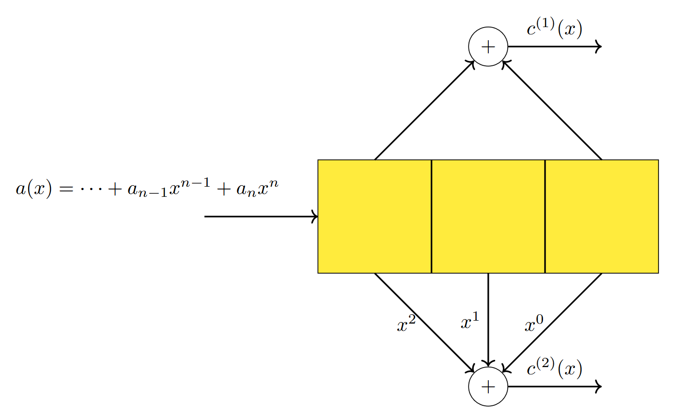
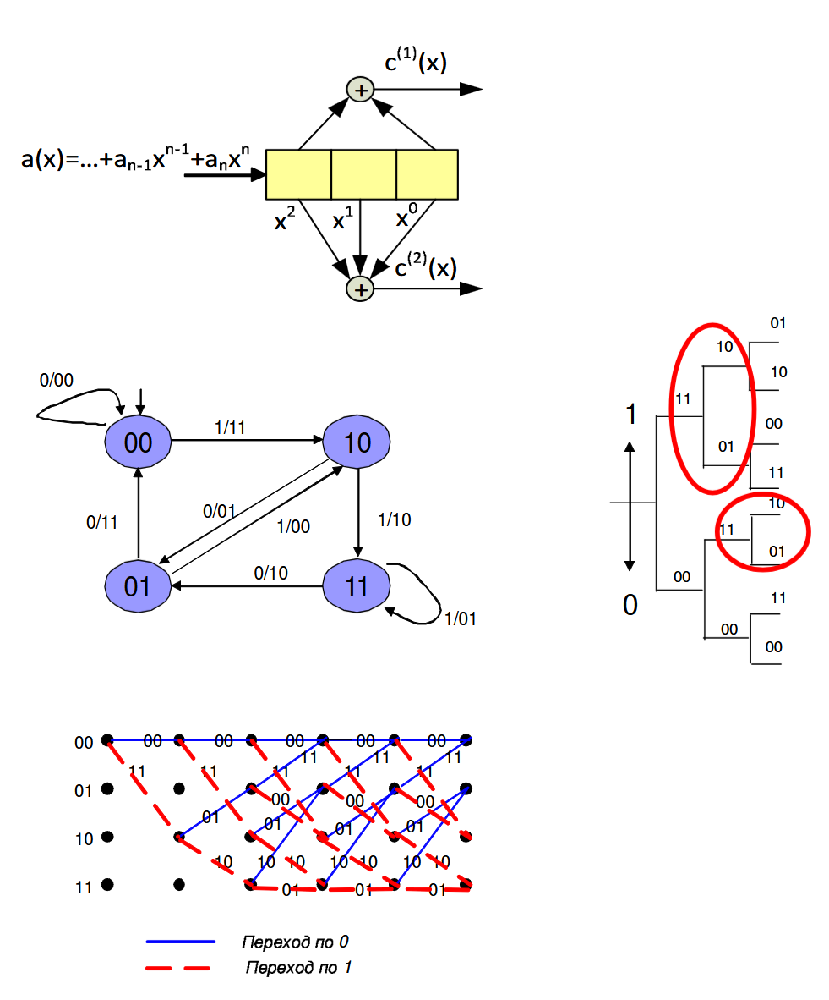
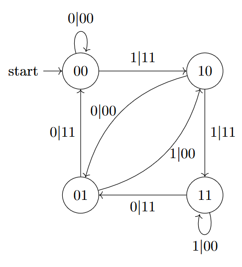
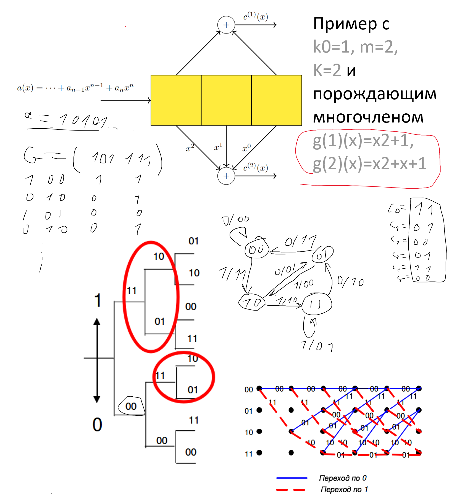
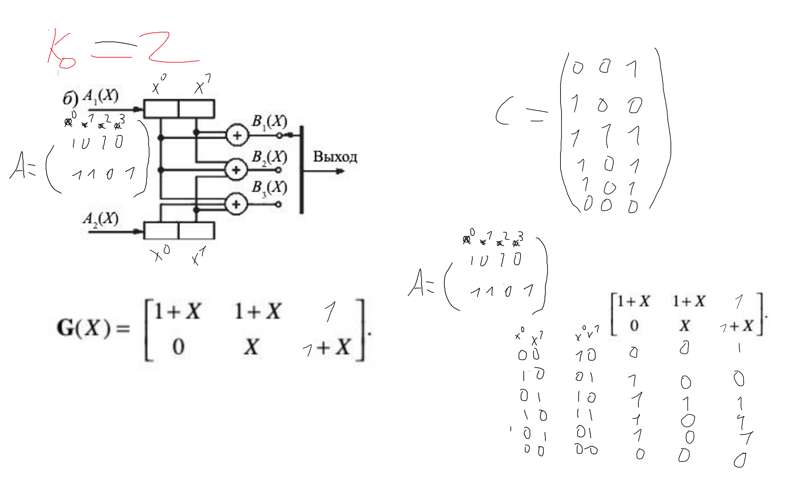

# Сверточные коды. Способы представления. Катастрофические порождающие матрицы

**Сверточные коды** — класс кодов, реализующих автоматное отображение блоков данных в кадры кодового слова. Пример: регистр сдвига. Они преобразуют блок из $k$ символов в блок из $n$ символов. Преобразование зависит от предыдущих блоков.

Свойства и параметры сверточных кодов:

* кодер сверточных кодов хранит $m$ ранее поступивших блоков
* размер блоков равен $k_0$ символов (число регистров)
* на каждом шаге кодер выдает $n_0$ закодированных символов (число сумматоров, которые подключены к регистрам)
* скорость кода $R = \dfrac{k_0}{n_0}$
* объем памяти кодера – длина кодового ограничения $K = mk_0$ (суммарный размер регистров)

Пример с $k_0=1, m=2, K=k_0m = 2,m, n_0=2$ и порождающим многочленом $g^{(1)}(x)=x^2+1, g^{(2)}(x)=x^2+x+1$:

Рассмотрим случай при $k_0 = 1$. Тогда, выходная последовательность - линейная свертка информационной
последовательности и порождающих многочленов кода

$$
  c^{(i)}{(x)} = c_{0}^{(i)} + c_{1}^{(i)} + \ldots = a(x)g^{(i)}{(x)} = \sum_{j \geqslant 0}{\left(x^{j} \cdot \sum_{t = 0}^{m}{a_{j - t}g_{t}^{(i)}}\right)}, ~ 1 \leqslant i \leqslant n_0
$$

Чтобы код не был бесконечен, в конец информационной последовательности вводят несколько дополнительных битов, переводящих регистр сдвига в нулевое состояние.

В общем случае, у нас есть порождающая матрица (многочленная) кода: $G(x) = k_{0} \times n_{0}$, а кодирование выглядит так:

$$
  \left(c^{(1)}(x), \ldots, c^{(n_{0})}(x)\right)=\left(a^{(1)}(x), \ldots, a^{(k_{0})}(x)\right)G(x)
$$

Сверточные коды являются *линейными*.

---

Сверточные коды можно представить в виде

* конечного автомата
* дерева последовательностей возможных переходов конечного автомата (такое представление обладает свойством самоподобия)
* решетчатой диаграммы — кодовым словом является путь в решетке, начинающийся и заканчивающийся в нулевом состоянии, при этом
  * здесь у нас фиксированная длина
  * предполагается, что после обработки информационной последовательности были поданы несколько дополнительных битов, переводящих регистр сдвига в нулевое состояние

---

Минимальное расстояние Хемминга для любых последовательностей из $l$ кадров, отличающихся начальным кадром, называется $l$-м **минимальным расстоянием кода** $d_{l}^{\star}$.

$d_{m + 1}^{\star}$ - минимальное расстояние кода, где $m$ - количество блоков, размерами $k_0$.

$d_{1}^{\star}, d_{2}^{\star}, d_{3}^{\star}, \ldots$ - дистанционный профиль кода.

$d_{\mathtt{free}} = \max_{l}{\left(d_{l}^{\star}\right)}$ - минимальное свободное расстояние кода.

Свободная длина $n_{\mathtt{free}}$ - это длина имеющего наименьший вес ненулевого начального сегмента кодовой последовательности сверточного кода.

Предположим, что сверточный код имеет $l$-е минимальное расстояние $d_l^{\star}$. Если в первых $l$ кадрах произошло не более $t$ ошибок, причем $t$ удовлетворяет неравенству $2t + 1 \leqslant d_{l}^{\star}$, то ошибки, которые появились в первом кадре кодового слова, могут быть исправлены.

В частности выберем $l = m$, минимальное расстояние кода $d^{\star}$ равно $d_{m}^{\star}$. Тогда при $t$, удовлетворяющем неравенству $2t + 1 \leqslant d^{\star}$, код исправит первый кадр кодового слова, если на длине первого блока появилось не более $t$ ошибок.

---

**Катастрофическим** называется такой *сверточный код*, для которого конечное число ошибок, приобретенных в канале связи, может привести к бесконечному числу ошибок в декодированных символах.

Более формально: катастрофический кодер отображает информационные последовательности бесконечного веса в кодовые последовательности конечного веса. Обычно, такой кодер характеризуются наличием петель *нулевого веса выходной последовательности при ненулевом весе входной последовательности* (состояние регистов + символ перехода) в графе переходов.

Грубо говоря, если при передаче нулевого кодового слова возникла ошибка вида `...00011000...`, то она будет продекодирована в информационную последовательность вида `...0001010101010...`.

Пример порождающей матрицы катастрофического кодера: $G(x) = (x^2 +1, ~ x^2 + 1)$.

**Теорема**. Порождающая матрица не является катастрофической тогда, когда НОД определителей всех $k_0 \times k_0$ подматриц $G(x)$ равен $x^s$, где $s \geqslant 0$.

---

## Примеры

> Через час те из вас, кто останется в живых - будут завидовать мёртвым!

  

  

