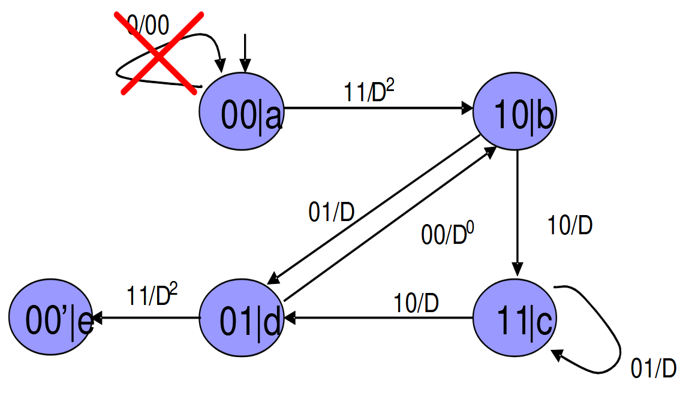

# Производящая функция сверточных кодов. Вероятность ошибки декодирования сверточных кодов с помощью алгоритма Витерби

**Производящая функция** сверточных кодов отражает число кодовых слов различного веса.

* *Вероятность ошибки декодирования кода определяется числом кодовых слов различного веса*. Это означает, что вероятность ошибки при декодировании зависит от количества кодовых слов (последовательностей бит), которые имеют одинаковый "вес" — количество единиц в последовательности. Чем больше таких кодовых слов, тем выше вероятность ошибки.
* *Число путей в решетке, начинающихся и заканчивающихся в нулевом состоянии*. Сверточные коды можно представить как граф или решетку состояний. Путь в этой решетке начинается и заканчивается в "нулевом состоянии" — начальном состоянии кодера. Количество таких путей связано с количеством возможных кодовых слов.

Построение производящей функции:

* Пометим ребра графа переходов метками $D^i$, где $i$ – вес выходной последовательности. В графе переходов каждое ребро (переход между состояниями) помечается степенью $D^i$, где $i$ — количество единиц (вес) в выходной последовательности, связанной с этим переходом.
* Последовательность символов веса $x$ характеризуется одночленом $D^x$.
* Совокупность кодовых слов характеризуется многочленом, например $2D^6 + 3D^8$. Здесь многочлен $2D^6 + 3D^8$ означает, что есть $2$ кодовых слова с весом $6$ и $3$ кодовых слова с весом $8$.
* Расщепим исходное состояние на два: начальное (0) и конечное (e).
* Пусть $X^i$ характеризует совокупность кодовых последовательностей, приводящих кодер в состояние $i$. Тогда, $X^i$​ – ряд, коэффициенты которого равны числу кодовых последовательностей, начинающихся в нулевом и заканчивающихся в $i$-ом состоянии.
* Наконец, производящая функция $T(D) = \dfrac{X_{e}}{X_{a}}$. Производящая функция $T(D)$ описывает общую структуру кодовых слов и вычисляется как отношение рядов $X_e$​ (которые заканчиваются в конечном состоянии) к $X_a$ (которые начинаются в начальном состоянии). Это степенной ряд, где каждый коэффициент указывает на количество кодовых слов определённого веса, возвращающихся в нулевое состояние.

Пример построения производящей функции. Дан сверточный код в виде конечного автомата.

Выразим для него производящую функцию:

$$
  \begin{cases}
    X_b = D^2X_a + X_d \\
    X_c = DX_b + DX_c \\
    X_d = DX_c + DX_b \\
    X_e = D^2X_d
  \end{cases} \implies T(D) = \dfrac{D^5}{1 - 2D} = D^5 + 2D^6 + 4D^7 + 8D^8 + \ldots
$$

Свойства производящей функции:

1. Степень нулевого члена — минимальное свободное расстояние кода.
2. Можно доказать, что минимальное свободное расстояние пропорционально длине кодового ограничения.

---

**Расширенная производящая функция** — производящая функция, построенная по указанному выше алгоритму, но вместо метки $D^i$ на ребрах используется метка $D^iN^j$, причем $j$ равен биту перехода. В итоге получается степенной ряд от переменных $N$ и $D$, в котором коэффициент при $D^aN^b$ равен число кодовых последовательностей веса $a$, порождаемых информационными последовательностями веса $b$.

---

Вероятность **ошибки** — вероятность того, что будет выбран какой-либо неправильный путь. Если производящая функция имеет вид $T(D) = \displaystyle\sum{\left(t_dD^d\right)}$, то вероятность ошибки:

$$
  \begin{align*}
    P_e &= P\left\{(C_1 > C_0) \lor (C_2 > C_0) \lor \ldots \right\} \leqslant \sum_{i}{\left(P\{C_{i} > C_0\}\right)} \\
        &= \sum_{d > 0}{t_dP_d} \\
        &= \sum_{d = d_{\mathtt{free}}}{\left(t_dQ\left(\sqrt{2dR\dfrac{E_b}{N_0}}\right)\right)}
  \end{align*}
$$

Здесь:

* $P_e$: Вероятность ошибки декодирования. Это вероятность того, что будет выбран неправильный путь при декодировании.
* $C_0$: Метрика (накопленная ошибка) правильного пути (корректной кодовой последовательности).
* $C_i$: Метрика для неправильного пути $i$. Это метрика для альтернативных путей, которые могут привести к ошибке декодирования.
* $t_d$: Количество путей в кодере, которые имеют метрику $d$. Это число путей, для которых кодовая последовательность отличается от правильной на расстояние $d$.
* $P_d$: Вероятность того, что метрика для пути с расстоянием $d$ больше, чем метрика для правильного пути $P_d = P\{C_i > C_0\}$.
* $Q(\ldots)$: Функция $Q$, используемая для оценки вероятности того, что гауссовский случайный процесс превысит определённое значение. Она применяется для оценки вероятности ошибки из-за шума.
* $R$: Скорость кода, равная отношению числа информационных бит к общему числу переданных бит $R = \dfrac{k}{n}$.
* $\dfrac{E_b}{N_0}$: Отношение энергии на бит к спектральной плотности мощности шума, определяющее уровень шума в канале связи.

Пояснение формулы:

* $P\left\{(C_1 > C_0) \lor (C_2 > C_0) \lor \ldots \right\}$: Это вероятность того, что метрика любого неправильного пути $C_i$​ окажется больше метрики правильного пути $C_0$, что приводит к ошибке декодирования.
* Неравенство $P_e \leqslant \sum_{i}{\left(P\{C_{i} > C_0\}\right)}$: Используется неравенство объединения (суммирование вероятностей событий), чтобы получить верхнюю оценку вероятности ошибки декодирования. Каждое слагаемое $P\{C_i > C_0\}$ оценивает вероятность того, что конкретный неправильный путь будет выбран.
* Суммирование по $d>0$: Здесь учитываются все возможные расстояния $d$, которые превышают ноль, то есть все ошибочные пути, которые могут быть приняты вместо правильного.
* Сумма $\sum_{d = d_{\mathtt{free}}}{\left(t_dQ\left(\sqrt{2dR\dfrac{E_b}{N_0}}\right)\right)}$: Каждое слагаемое в этой сумме умножает количество путей с метрикой $d$ на вероятность того, что метрика этого пути превысит метрику правильного пути. Функция $Q$ используется для оценки этой вероятности на основе гауссовского шума.

Эта формула даёт верхнюю оценку вероятности ошибки декодирования $P_e$ сверточного кода при использовании алгоритма Витерби в канале с аддитивным белым гауссовым шумом (АБГШ). Она учитывает количество возможных ошибочных путей и их вероятность, что позволяет оценить общую вероятность того, что декодер выберет неправильный путь. Чем выше $\dfrac{E_b}{N_0}$ и чем больше свободное расстояние $d_{\mathtt{free}}$, тем ниже вероятность ошибки.

Пусть, расширенная производящая функция $T(N, D) = \displaystyle\sum_{w, d}{\left(t_{wd}N^wD^d\right)}$. Тогда, общая вероятность ошибки декодирования на бит выражается следующим образом:

$$
  P_b \leqslant \dfrac{1}{k_0} \sum_{d = d_{\mathtt{free}}}^{\infty}{\left(b_dQ\left(\sqrt{2Rd\dfrac{E_b}{N_0}}\right)\right)}
$$

Здесь:

* $P_b$: Вероятность ошибки на бит. Это вероятность того, что декодированный бит будет неверным.
* $k_0$: Среднее число информационных бит, передаваемых на одну кодовую последовательность. Это нормировочный фактор, который учитывает количество переданных информационных бит.
* $\sum_{d = d_{\mathtt{free}}}^{\infty}$: Суммирование начинается с $d_{\mathtt{free}}$, минимального свободного расстояния кода, и продолжается до бесконечности. Это учитывает все возможные кодовые слова, начиная с минимального расстояния.
* $b_d$: Количество кодовых последовательностей с расстоянием $d$ (весовые коэффициенты). Это весовой спектр кода, который показывает, сколько кодовых слов имеют определённое расстояние $d$.
* $Q(...)$: Функция $Q$, которая даёт вероятность того, что гауссовский случайный процесс примет значение выше заданного. Она используется для оценки вероятности того, что шум вызовет ошибку.
* $R$: Скорость кода, определяемая как отношение числа информационных бит к общему числу переданных бит $R = \dfrac{k}{n}$.
* $d$: Кодовое расстояние между различными кодовыми словами. Чем больше $d$, тем лучше код исправляет ошибки.
* $\dfrac{E_b}{N_0}$: Отношение энергии на бит к спектральной плотности мощности шума. Это ключевой параметр, определяющий уровень шума в канале связи. Чем выше это отношение, тем лучше передача.

Эта формула показывает, как вероятность ошибки на бит $P_b$ зависит от расстояния между кодовыми словами $d$, параметров кода $R$ и $b_d$, и уровня шума в канале $\dfrac{E_b}{N_0}$. Чем больше свободное расстояние $d_{\mathtt{free}}$ и лучше условия передачи - выше $\dfrac{E_b}{N_0}$, - тем ниже вероятность ошибки.
