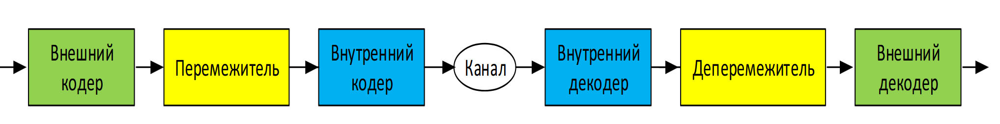
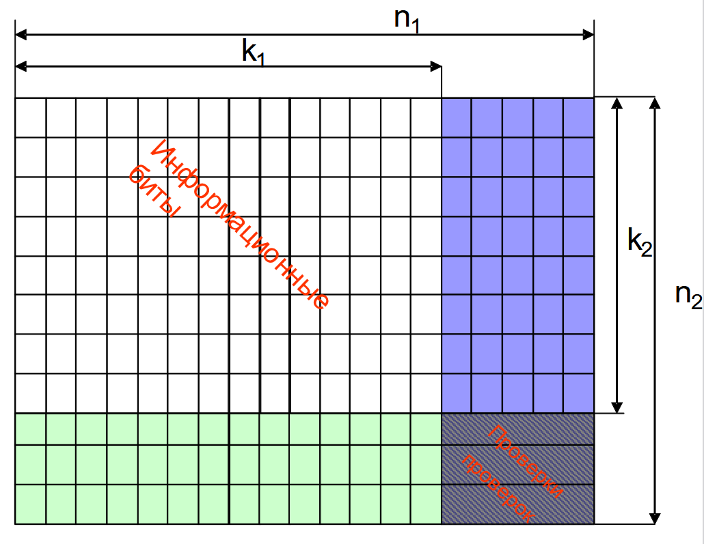
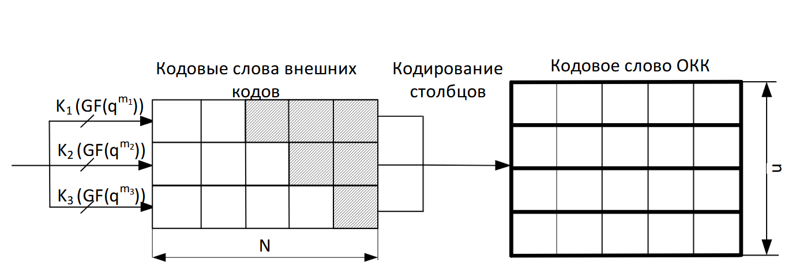
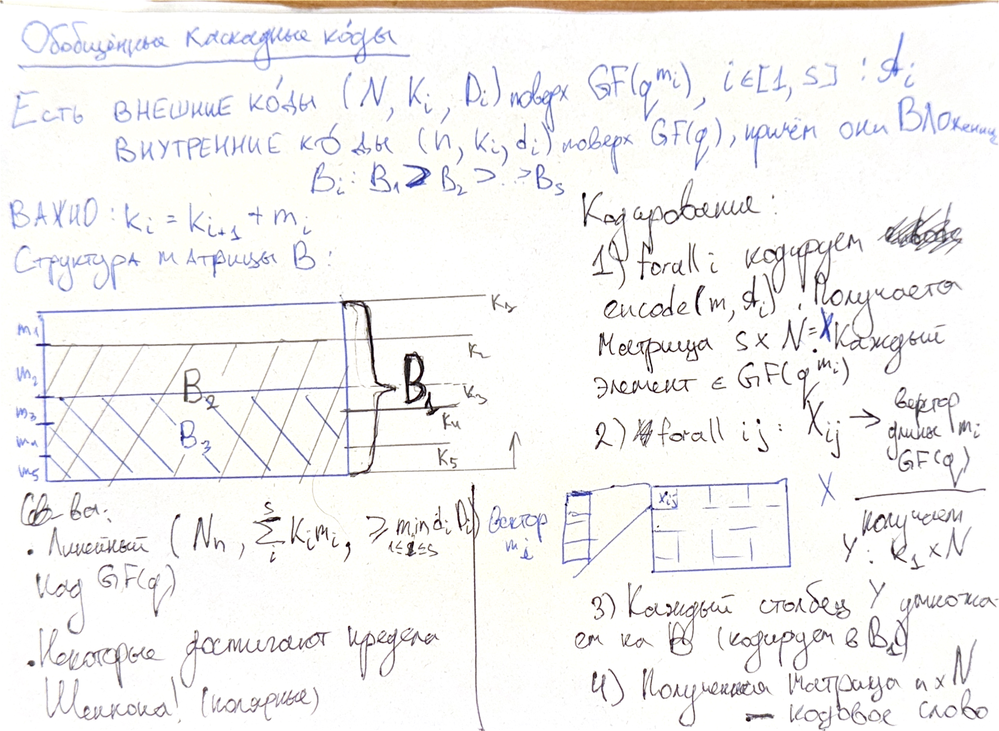

# Конструкция Плоткина. Коды Рида-Маллера. Прямое произведение кодов. Обобщенные каскадные коды

**Конструкция Плоткина** — это метод построения нового кода из двух заданных кодов, который позволяет улучшать или комбинировать их параметры. Это один из способов построения длинных кодов из коротких.

**Теорема**. Пусть даны $(n_i, k_i, d_i)$ коды $C_i$, где $i = 1, 2$. Тогда, $C = \{(c_1, c_1 + c_2\ |\ c_i \in C_i, ~ i = 1, 2)\}$ - это $(2n, k_1 + k_2, \min{(2d_1, d_2)})$ код. Разберемся, что же имеется ввиду в теореме:

* *Дано*. Два линейных кода $C_1$ и $C_2$, которые имеют параметры:
  * $n_i$ - длина кода.
  * $k_i$ - размерность (число информационных символов).
  * $d_i$ - минимальное кодовое расстояние.
* *Конструкция*. Конструкция Плоткина определяет новый код $C$ следующим образом: $C = \{(c_1, c_1 + c_2\ |\ c_i \in C_i, ~ i = 1, 2)\}$. Это означает, что каждый кодовый элемент нового кода $C$ является парой из двух частей:
  1. Первый элемент пары — это кодовое слово $c_1 \in C_1$.
  2. Второй элемент пары — это сумма по модулю 2 того же кодового слова $c_1$ и кодового слова $c_2 \in C_2$.
* *Параметры нового кода C*.
  * Длина нового кода: $2n$ (если $n_1 = n_2 = n$, так как каждый элемент состоит из двух частей длиной $n$).
  * Размерность нового кода: $k_1 + k_2$.
  * Минимальное кодовое расстояние: $\min{(2d_1, d_2)}$.

**Декодирование** в такой конструкции выглядит так: при получении вектора $(y', y'')$ сначала декодером кода $C_2$ декодируется вектор $y''' = y'' - y'$, получается вектор $c_2$, а далее декодируется вектора $y'$ и $y'' - c_2$. Таким образом получается вектор $c_1$.

---

**Кодом Рида-Маллера** $\mathtt{RM}(r, m)$ порядка $r$ и длины $2m$ называется множество векторов, полученных путем вычисления значений многочленов

$$
  a(V_1, \ldots, V_m) = \displaystyle\sum_{i_1 + \ldots + i_m \leqslant r}{\left(V_1^{i_1} \dots V_m^{i_m}\right)}, ~ i_1, \ldots i_m \in \{0, 1\}
$$

во всех точках $(v_1, \ldots, v_m) \in \mathbb{F}_2^{m}$.

Код Рида-Маллера образуется через *рекурсивное применение конструкции Плоткина*:

* $\mathtt{RM}(r, m)$ — код Рида-Маллера порядка $r$ длины $2^m$
* $\mathtt{RM}(0, m) = (2^m, 1, 2^m)$
* $\mathtt{RM}(m, m) = (2^m, 2^m, 0)$
* $\mathtt{RM}(r + 1, m + 1)$: применение конструкции Плоткина к $C_1 = \mathtt{RM}(r + 1, m)$, $C_2 = \mathtt{RM}(r, m)$.

Также коды Рида-Маллера $(RM(r, m))$ длины $2^m$ порядка $r$ можно определить, как полярный код с $\mathcal{F} = \{i \mid 0 \leq i \leq 2^m, wt(i) < m - r\}$

Размерность будет $k = \sum^m_{i = m - 3} C^i_m = \sum^r_{i=0}C^i_m$

Минимальное расстояние $d = 2^{m-r}$

Это можно сделать благодаря теореме:

Если нам даны $(n, k_i, d_i)$ коды $C_i, i = 0,1$ $C=\{(c_1 + c_0, c_1)\mid _i \in C_i\}$

---

В чём состоит идея **каскадных кодов**?

1. Сначала мы кодируем данные каким-то *внешним кодом*.
2. Далее, каким-то образом мы *переставляем символы получившихся кодовых слов* (в общем случае - переставляем, иногда ничего не делаем).
3. Затем, кодируем каким-то *внутренним кодом*.
4. Отправляем всё это дело в *канал*.
5. Декодируем *внутренний код*.
6. Фактически, *переставляем* в обратном порядке.
7. И, наконец, декодируем *внешним кодом*.

Идея перемежителя состоит в том, что если декодер внутреннего кода ошибётся, то получившейся пакет ошибок был бы разбит между различными кодовыми словами внешнего кода или они как-то были бы разнесены далеко друг от друга и в результате они могли бы быть исправлены потом.

В исходном понимание каскадные коды исходят из следующих соображений:

* Давайте возьмем полезные данные $(N, K, D)$ и закодируем их каким-нибудь полем Галуа $\mathrm{GF}(q^k)$ (элементами такого поля можно рассматривать как векторы длины $k$, а число $q$ обычно равно $2$). То есть, мы взяли данные и закодировали их таким внешним кодом, как правило - это так называемые коды Рида-Соломона.
* Рассматривая символы кодового слова как векторы длины $k$ над полем $\mathrm{GF}(q)$, закодируем каждый такой символ $(n, k, d)$ внутренним кодом надо полем $\mathrm{GF}(q)$.
* По итогу, получаем код длины $N \cdot n$, размерности $K \cdot k$ и с минимальным расстоянием $D \cdot d$ над полем $\mathrm{GF}(q)$ - $(Nn, Kk, Dd)$.

---

Рассмотрим один примеров каскадных кодов - **прямое произведение кодов**.

* Пусть даны компонентный код №1 $(n_1, k_1, d_1)$ (кодирование по строчкам) и компонентный код №2 $(n_2, k_2, d_2)$ (кодирование по столбцам) коды с порождающими матрицами $G'$ и $G''$.
* Возьмем данные и закодируем их кодом №1, получившейся кодовые слова запишем в виде строчек таблице.
* Далее, закодируем каждый столбец получившейся таблицы кодом №2.
* В результате, получается таблица размерности $n_1 \times n_2$ и прочитав её по строчкам мы получим кодовое слово кода $(n_1 \cdot n_2, k_1 \cdot k_2, d_1 \cdot d_2)$ (длина кода, размерность кода и минимальное расстояние).

Формально, мы получили матрицу результатом произведения Кронекера:

$$
  G' \otimes G'' =
  \begin{pmatrix}
  G'_{11}G'' & G'_{12}G'' & \ldots & G'_{1n_1}G'' \\
  G'_{21}G'' & G'_{22}G'' & \ldots & G'_{2n_1}G'' \\
  \vdots     & \vdots     & \ddots & \vdots       \\
  G'_{k_11}G'' & G'_{k_12}G'' & \ldots & G'_{k_1n_1}G''
  \end{pmatrix}
$$

Скорость этого кода равна произведению компонентных кодов: $R = \dfrac{k_1k_2}{n_1n_2} < \dfrac{k_1}{n_1}, \dfrac{k_2}{n_2}$ (меньше, чем каждый код по отдельности).

На самом деле, код также способен исправить многие конфигурации ошибок веса $> \dfrac{d_1d_2}{2}$.

Полезная вещь - здесь возможно параллельное кодирование кодовых слов.

---

**Обобщенные каскадные коды**. А теперь обобщим в общем смысле каскадные коды.

* Давайте вооружимся *семейством* внешних $(N, K_i, D_i)$ кодов $\mathcal{A}_{i}$ над какими-то расширенными полями $\mathrm{GF}(q^{m_i})$, для всех $1 \leqslant i \leqslant s$.
* Также, нам понадобится семейство вложенных внутренних $(n, k_i, d_i)$ кодов $\mathcal{B}$: $\mathcal{B}_1 \supset \mathcal{B}_2 \supset \ldots \supset \mathcal{B}_s$ над полем $\mathrm{GF}(q)$, такие что
  * разности их размерностей равны соответствующим $m_i$, то есть $k_i - k_{i + 1} = m_i$,
  * надо построить матрицу $\mathcal{B}$ и будем считать, что код $\mathcal{B}_i$ порождается последними $k_i$ строками этой матрицы.

Как работает кодирование?

1. Закодируем данные внешними кодами и запишем полученные кодовые слова в $s \times N$ матрицу $X$.
2. Затем, заменим элементы $i$-ой строки этой матрицы $X$ на их векторное представление, то есть вектор - столбец длины $m_i$. И пусть $Y$ - это полученная матрица размеров $k_1 \times N$.
3. Затем, каждый столбец матрицы $Y$ закодируем внутренним кодом $\mathcal{B}_{1}$ (именно код №1).
4. Наконец, полученная матрица $n \times N$ может рассматриваться как кодовое слово.

Разница между каскадными кодами и обобщенными каскадными кодами в том, что в первом случае $s = 1$.

По итогу, получаем код $\left(Nn, \displaystyle\sum_{i = 1}^{s}{K_im_i}, \min_{1\leqslant i\leqslant s}{d_iD_i}\right)$ над полем $\mathrm{GF}(q)$.

Как работает декодирование?

1. Запишем принятые символы в виде матрицы размерами $n \times N$. Сообщение делится на блоки, каждый из которых кодируется отдельным кодом внутреннего уровня.
2. Далее для каждого $i \in [1, \ldots, s]$ проводим следующий алгоритм:
   1. Продекодируем столбцы в коде $\mathcal{B}_i$ (внутренний). Каждый блок декодируется с использованием алгоритма, соответствующего коду внутреннего уровня.
   2. Продекодируем $i$-ую строку в коде $\mathcal{A}_{i}$ (внешний). Используется декодер для кода внешнего уровня, который работает с уже частично исправленными данными. Пусть $(c_1, \ldots, c_n)$ - найденное кодовое слово.
   3. Вычтем из $j$-го столбца $c_j\mathcal{B}^{\mathrm{T}}_i$. Это корректирует столбцы с учетом исправленного кодового слова, полученного на предыдущем этапе.

> Про обобщённые каскадные коды наглядно от @sn1tr0n: 

