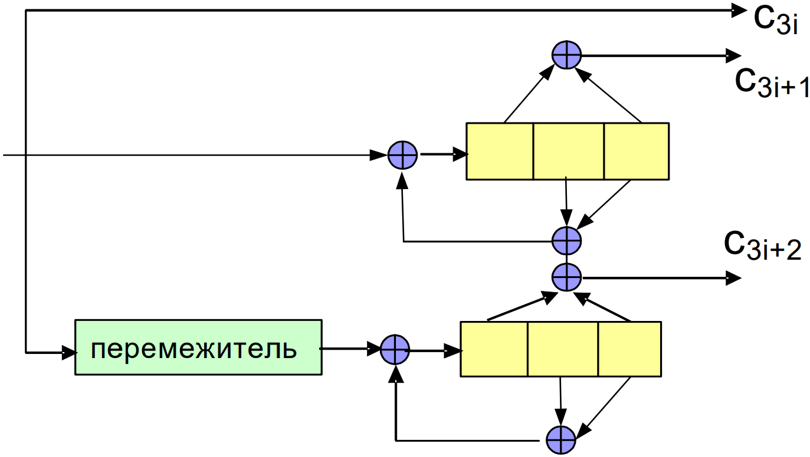
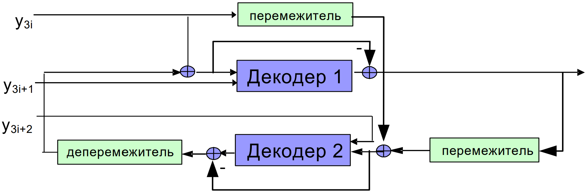

# Укорочение, выкалывание и расширение кодов. Турбо-коды

## Укорочение

Укороченный код получается путем выбора кодовых слов исходного кода, содержащих нули на
заданных позициях, с последующим удалением этих нулей.

*Как это делать?*

Пусть  дан $(n, k, d)$ код с порождающей матрицей $G = (I|A)$.

Удалим из порождающей матрицы $m$ столбцов единичной подматрицы и соответствующие $m$ строк.
Получится порождающая матрица для $(n - m, k - m, \ge d)$ кода.

*Пример:*

Был $(7, 4, 3)$ совершенный код, эквивалентный коду Хэмминга:

$$
G =
\begin{pmatrix}
1 & 0 & \textcolor{red}{0} & \textcolor{red}{0} & 1 & 0 & 1 \\
0 & 1 & \textcolor{red}{0} & \textcolor{red}{0} & 1 & 1 & 1 \\
\textcolor{red}{0} & \textcolor{red}{0} & \textcolor{red}{1} & \textcolor{red}{0} & \textcolor{red}{1} & \textcolor{red}{1} & \textcolor{red}{0} \\
\textcolor{red}{0} & \textcolor{red}{0} & \textcolor{red}{0} & \textcolor{red}{1} & \textcolor{red}{0} & \textcolor{red}{1} & \textcolor{red}{1}
\end{pmatrix}
$$

Удаляем $m = 2$ столбцов и строк.

Стал $(5, 2, 3)$ код (не совершенный):

$$
G' =
\begin{pmatrix}
1 & 0 & 1 & 0 & 1 \\
0 & 1 & 1 & 1 & 1
\end{pmatrix}
$$

Множество кодовых слов полученного кода - это подмножество кодовых слов изначального кода, причем из всех кодовых слов выкинуты 3 и 4 нулевые символы.

## Выкалывание

Выколотый код: удалим из всех кодовых слов заданные символы (как правило, проверочных)

*Как это делать?*

Пусть дана проверочная матрица матрица $(n, k, d)$ кода в форме $H = (A|-I)$

Удалим из $H$ $m$ столбцов единичной подматрицы и соответствующие им $m$ строк.
Получится $(n − m, k,\ge d − m)$ код.

В результате выкалывания может получиться так, что какие-то кодовые слова перестанут быть различимыми.

## Расширение

Существует много способов расширить коды. Мы рассмотрели только простой, но самый распространенный - добавление проверки на четность.

*Как это делать?*

Пусть дан $(n, k, d)$ код с порождающей матрицей $G$ и проверочной матрицей $H$

Добавим ко всем кодовым словам нулевой символ равный сумме всех символов кодового слова.

Получится $(n + 1, k, d')$ код.

Если минимальное расстояние $d$ исходного кода нечётно, то минимальное расстояние расширенного кода $d' = d + 1$

$(7, 4, 3)$ код Хемминга:

$$
G =
\begin{pmatrix}
1 & 1 & 1 & 0 & 0 & 0 & 0 \\
1 & 0 & 0 & 1 & 1 & 0 & 0 \\
0 & 1 & 0 & 1 & 0 & 1 & 0 \\
1 & 1 & 0 & 1 & 0 & 0 & 1
\end{pmatrix}
$$

$$
H =
\begin{pmatrix}
1 & 0 & 1 & 0 & 1 & 0 & 1 \\
0 & 1 & 1 & 0 & 0 & 1 & 1 \\
0 & 0 & 0 & 1 & 1 & 1 & 1
\end{pmatrix}
$$

Полученный $(8, 4, 4)$ расширенный код Хемминга:

$$
G' =
\begin{pmatrix}
\textcolor{red}{1} & 1 & 1 & 1 & 0 & 0 & 0 & 0 \\
\textcolor{red}{1} & 1 & 0 & 0 & 1 & 1 & 0 & 0 \\
\textcolor{red}{1} & 0 & 1 & 0 & 1 & 0 & 1 & 0 \\
\textcolor{red}{0} & 1 & 1 & 0 & 1 & 0 & 0 & 1
\end{pmatrix}
$$

$$
H' =
\begin{pmatrix}
\textcolor{red}{0} & 1 & 0 & 1 & 0 & 1 & 0 & 1 \\
\textcolor{red}{0} & 0 & 1 & 1 & 0 & 0 & 1 & 1 \\
\textcolor{red}{0} & 0 & 0 & 0 & 1 & 1 & 1 & 1 \\
\textcolor{red}{1} & \textcolor{red}{1} & \textcolor{red}{1} & \textcolor{red}{1} & \textcolor{red}{1} & \textcolor{red}{1} & \textcolor{red}{1} & \textcolor{red}{1}
\end{pmatrix}
$$

## Турбо-коды

Ещё один способ комбинирования кодов - турбо-коды.

Предлагается одни и те же данные закодировать сразу несколькими скажем так экземплярами свёрточного кода. А именно:

1) Кодирование предполагается систематическим, поэтому вот эти полезные данные мы сразу выдаем на выход, как часть кодового слова ($c_{3i}$)

2) Далее берем кодер свёрточного кода и кодируем те же данные с помощью него ($c_{3i + 1}$)

3) Далее берем эти же самые данные некоторым образом переставляем и тоже кодируем с помощью свёрточного кодера ($c_{3i + 2}$)

Одновременное кодирование информационных битов несколькими сверточными кодами позволяет
исключить многие конфигурации ошибок, которые могли бы возникнуть при использовании
независимых сверточных кодов

Выше описанная схема - не догма,
можно использовать больше кодеров (тогда уменьшится скорость),
можно использовать разные кодеры (на картинке один и тот же),
можно использовать выкалывание для увеличения скорости (так как скорость у нас получается уменьшилась в 3 раза).

Главное:

1. Должны использоваться рекурсивные систематические сверточные коды.

  Многие информационные последовательности малого веса превращаются в кодовые слова большого веса.

1. Длина кодового ограничения должна быть небольшой.

Кодам с большим кодовым ограничением присущи длинные пакеты ошибок декодирования.

Очевидно (да?), что турбо-коды - линейные блоковые коды.

Можно доказать, что минимальное расстояние в турбо-кодах получается довольно плохим.
Но их используют, так как преимуществом (единственным) турбо-кода является возможность декодирования с линейной по длине кода сложностью. Благодаря этой
возможности, можно выбрать длину кода практически любой, на
практике от сотен бит до десятков тысяч бит, и достичь рекордных уровней надежности, немыслимых при использовании многих
других классов кодов.

## Турбо-декодер

Основной идеей турбо-декодирования является поочередное декодирование компонентных сверточных кодов, причем результаты декодирования одного кода являются “подсказками” для другого декодера.
Этот процесс повторяется несколько раз и при удачном стечении обстоятельств приводит к кодовому слову турбо-кода, являющемуся наиболее
вероятным для данной принятой последовательности.

### Описание картинки

Берём принятые символы и разбиваем их на 3 части, в зависимости откуда они пришли. Берём декодер свёрточного кода №1. Декодируем свёрточный код с мягким выходом, используя БКЕР. Этот декодер возвращает избыточную информацию относительно каждого из символов кодового слова и она будет использоваться в качестве "подсказки", т.е. в качестве априорной информации о том, чему равны отдельные информационные символы второго свёрточного кода. Выход этого первого декодера переставляется таким же образом, как это делалось на стороне кодера, и отправляется в декодер свёрточного кода №2. К результату его декодирования применяется обратная перестановка, и оно подается в качестве априорной информации для декодера №1. И вот так вот оно крутится некоторое количество раз (как правило, достаточно 5-10 итераций).

Этот алгоритм не является алгоритмом декодирования по максимуму правдоподобия.

Сколько ошибок он исправляет толком никто не знает, но тем не менее работает очень даже неплохо.

Эта же конструкция применима и для декодирования прямого произведения кодов, и на практике и используется.

*Дальше какой-то пиздец*.

### К вопросу о том, а что конкретно должны считать эти декодеры

В 9 билете были изображены такие формулы для алгоритма БКЕР, который использует решётку компонентного кода:

Прямая рекурсия $\alpha'_{i}(s) = \dfrac{\displaystyle\sum_{\hat{s} \in V_{i - 1}}{\left(\alpha_{i - 1}(\hat{s}) \cdot \gamma_{i}(\hat{s}, s)\right)}}{\displaystyle\sum_{s' \in V_i}{\left(\displaystyle\sum_{\hat{s} \in V_{i - 1}}{\left(\alpha_{i - 1}(\hat{s}) \cdot \gamma_{i}(\hat{s}, s')\right)}\right)}}$, $0 < i \leqslant n$.

Обратная рекурсия $\beta'_{i}(\hat{s}) = \dfrac{\displaystyle\sum_{s \in V_{i + 1}}{\left(\gamma_{i + 1}(\hat{s}, s) \cdot \beta'_{i + 1}(s)\right)}}{\displaystyle\sum_{s \in V_{i}}{\left(\displaystyle\sum_{s' \in V_{i + 1}}{\left(\alpha'_{i}(s') \cdot \gamma_{i + 1}(s', s)\right)}\right)}}$, $0 \leqslant i < n$.

Вычисление ЛОПП $L_i = \ln{\dfrac{\displaystyle\sum_{(s', s) \in S_1}{\left(\alpha'_{i}(s') \cdot \gamma_{i + 1}(s', s) \cdot \beta'_{i + 1}(s)\right)}}{\displaystyle\sum_{(s' ,s) \in S_0}{\left(\alpha'_{i}(s') \cdot \gamma_{i + 1}(s', s) \cdot \beta'_{i + 1}(s)\right)}}}$

Интерес представляют величины $\gamma$ (здесь они выписаны для кода со скоростью $1/2$):

$\gamma_{i+1}(s', s) = p(s_{i+1} = s, y_{2i}, y_{2i+1} \mid s_i = s')
= P(s_{i+1} = s \mid s_i = s') p(y_{2i}, y_{2i+1} \mid s_i = s', s_{i+1} = s)
= P\{u_i = \delta(s', s)\} p(y_{2i}, y_{2i+1} \mid (c_{2i}, c_{2i+1}) = \Delta(s', s))$

- $P\{u_i = \delta(s', s)\}$ — априорная вероятность того, что информационный символ $u_i$ принимает значение, соответствующее метке перехода $\delta(s', s) \in \{0, 1\}$. В турбо-декодере эту вероятность вычисляет второй компонентный декодер.

- $\Delta(s', s)$ — пара символов, формируемая кодером при переходе из состояния $s'$ в $s$.

*Объяснение:* <https://www.youtube.com/live/GXp9DfedPVg?si=Ms7ex7Lu35EzlmCh&t=3704>

#### На самом деле, реальные декодеры работают в терминах не вероятностей а ЛОПП

- Внешние (extrinsic) ЛОПП:

  $$
  L_i^e = \ln \frac{P\{u_i = 0\}}{P\{u_i = 1\}} = \ln \frac{P\{u_i = 0\}}{1 - P\{u_i = 0\}}; \quad P\{u_i = 0\} = \frac{\exp(L_i^e)}{1 + \exp(L_i^e)}
  $$

- $$
  P\{u_i = a\} =
  \begin{cases}
  \frac{\exp(L_i^e / 2)}{1 + \exp(L_i^e)} \exp(L_i^e/2), & a = 0 \\
  \frac{\exp(-L_i^e / 2)}{1 + \exp(L_i^e)} \exp(-L_i^e/2), & a = 1
  \end{cases}
  $$

- Или:

  $$
  P\{u_i = a\} = A \exp \left( (-1)^a \frac{L_i^e}{2} \right)
  $$

- Пусть:

  $$
  S_i = \ln \frac{P\{y_i \mid c_i = 0\}}{P\{y_i \mid c_i = 1\}}
  $$

- Вероятности выходных символов:

  $$
  p(y_{2i}, y_{2i+1} \mid (c_{2i}, c_{2i+1})) = B \exp \left( \frac{(-1)^{c_{2i}} S_{2i} + (-1)^{c_{2i+1}} S_{2i+1}}{2} \right)
  $$

- Коэффициенты $A, B$ сокращаются во всех выражениях, используемых в алгоритме БКЕР, а потому могут быть отброшены.

#### Теперь к вопросу о том, как извлечь из одного декодера "подсказки" для другого декодера

- Предположим, что используется систематическое кодирование сверточных кодов и $c_{2i} = u_i$, где $u_i$ — информационные символы.

- Результатом работы алгоритма БКЕР являются:

  $$
  L_i = \ln \frac{P\{u_i = 0 \mid y_0, \dots, y_{2n-1}\}}{P\{u_i = 1 \mid y_0, \dots, y_{2n-1}\}}
  $$

- Для турбо-декодирования необходимо вычислить:

  $$
  \tilde{L}_i^e = \ln \frac{P\{u_i = 0 \mid Y_{2i}\}}{P\{u_i = 1 \mid Y_{2i}\}},
  $$

  где $Y_{2i} = (y_0, \dots, y_{2i-1}, y_{2i+1}, \dots, y_{2n-1})$.
  Это позволит исключить двойной учет принятых символов (по крайней мере, на первой итерации).

- Вероятность:

  $$
  P\{u_i = a \mid Y_{2i}, y_{2i}\} = \frac{P\{Y_{2i}, y_{2i} \mid u_i = a\}P\{u_i = a\}}{P\{Y_{2i}, y_{2i}\}}
  $$

- Расписываем:

  $$
  \begin{aligned}
  P\{u_i = a \mid Y_{2i}, y_{2i}\} &= \frac{P(Y_{2i} \mid u_i = a)P(y_{2i} \mid u_i = a)P\{u_i = a\}}{P(Y_{2i}, y_{2i})} \\
  &= \frac{P(Y_{2i} \mid u_i = a)P(y_{2i} \mid c_{2i} = a)P\{u_i = a\}}{P(Y_{2i}, y_{2i})}.
  \end{aligned}
  $$

- Отношение логарифмов вероятностей:

  $$
  L_i = \ln \frac{P\{Y_{2i} \mid u_i = 0\}}{P\{Y_{2i} \mid u_i = 1\}} + S_i + L_i^e.
  $$

- Различные полуитерации используют различные $Y_i$. При этом изначально известно, что $P\{u_i = 0\} = P\{u_i = 1\} = 1/2$.

  Поэтому:
  $$
  \tilde{L}_i^e = L_i - S_i - L_i^e.
  $$

### Итоговый итеративный алгоритм декодирования

1. Положить $L_{2 \to 1}^{e}(u_i) = 0$
2. Воспользоваться декодером БКЕР для сверточного кода 1
3. Подвергнуть перемежению полученные ЛОПП $\tilde{L}_i^e$ и использовать их как $L_{1 \to 2}^{e}(u_i)$
4. Воспользоваться декодером БКЕР для сверточного кода 2
5. Подвергнуть деперемежению полученные апостериорные ЛОПП $\tilde{L}_i^e$ и использовать их как $L_{2 \to 1}^{e}(u_i)$
6. Перейти к шагу 2, если не превышено максимальное число итераций (5–10)

### Построение перемежителей

##### Требование

Близкие позиции во входной последовательности должны отображаться в максимально удаленные позиции в выходной последовательности:

$
0 < |i - j| < d \Rightarrow | \pi(i) - \pi(j) | \geq S
$

##### Примечания

- Важны объем памяти, требуемый для реализации перемежителя, его задержка.
- **Псевдослучайный перемежитель**: случайная генерация с отбрасыванием перестановок с неудовлетворительными $S, d$.
- **Табличный перемежитель**:
  - Пример:
    Вход: $ (1, 2, 3, 4, 5, 6, 7, 8, 9, 10, 11, 12, 13, 14, 15, 16) $
    Выход:

    $$
    \begin{aligned}
    &\begin{bmatrix}
    1 & 2 & 3 & 4 \\
    5 & 6 & 7 & 8 \\
    9 & 10 & 11 & 12 \\
    13 & 14 & 15 & 16
    \end{bmatrix} \rightarrow
    (13, 9, 5, 1, 14, 10, 6, 2, 15, 11, 7, 3, 16, 12, 8, 4)
    \end{aligned}
    $$

- **Перестановочный полином**:
  Если $\displaystyle Q(x) = \sum_{i=0}^k q_i x^i \mod N$ — биекция в $Z_N$, то перестановка может быть задана как $Q(i) \to Q(i + 1)$. Пример:

  $$
  Q(x) = \frac{kx(x+1)}{2} \mod N, \quad k \equiv 1 \mod 2
  $$
