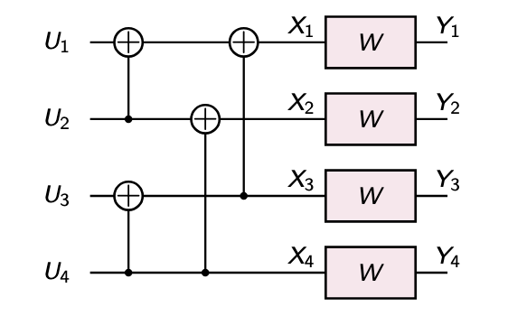
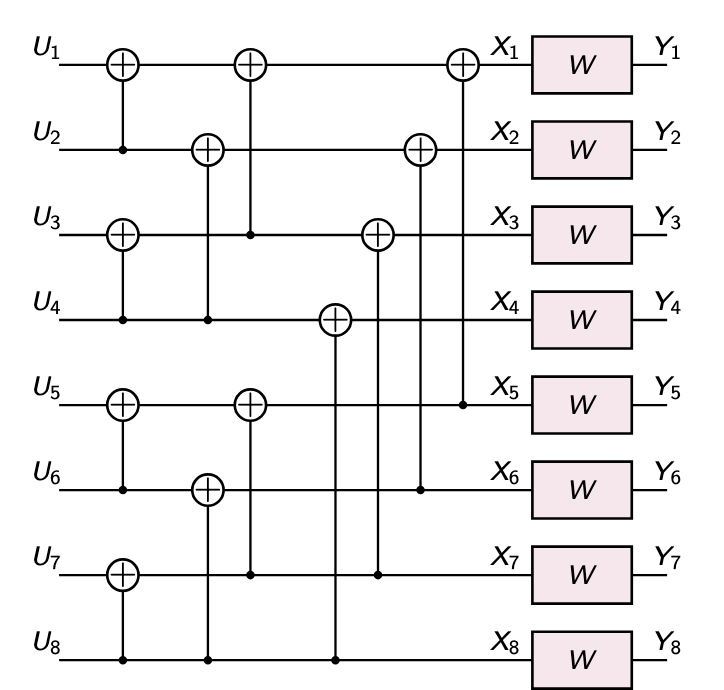
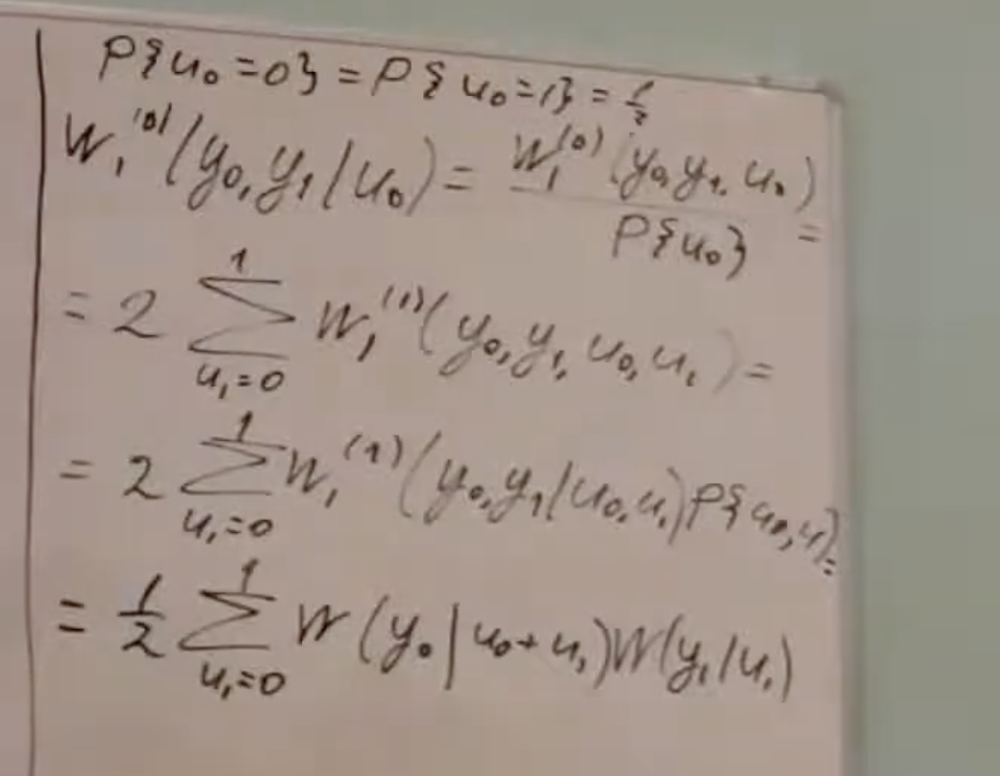

# Параметр Бхаттачарьи. Поляризация канала. Полярные коды. Сложность кодирования

## Напоминание про функции переходных вероятностей канала

Для полярных кодов мы буде рассматривать канал без памяти со входным алфавитом $X = \{0, 1\}$

Будем считать, что выходной алфавит канала ($Y$) дискретный.

**Для случая с дискретныым выходным алфавитом** $\mathcal{Y}$ :

- $W(y|c)$ — вероятность наблюдения на выходе канала $y \in \mathcal\{Y\}$ при условии подачи на его вход $c \in \mathcal{X}$.

- **Двоичный симметричный канал**: $\mathcal{Y} = \mathcal{X}$,  
  $$
  W(y|c) =
  \begin{cases}
  p, & y \neq x, \\
  1 - p, & y = x.
  \end{cases}
  $$

- **Двоичный стирающий канал**: $\mathcal{Y} = \{0, 1, \varepsilon\}$,  
  $$
  W(y|c) =
  \begin{cases}
  p, & y = \varepsilon, \\
  1 - p, & y = x \in \{0, 1\}.
  \end{cases}
  $$

- **Двоичный симметричный канал со стираниями**: $\mathcal{Y} = \{0, 1, \varepsilon\}$,  
  $$
  W(y|c) =
  \begin{cases}
  1 - p - s, & y = x, \\
  s, & y = \varepsilon, \\
  p, & y = 1 - x.
  \end{cases}
  $$

**Для непрервыного выходного алфавита** $\mathcal{Y}$

- $W(y|c)$ — плотность распределения выходного символа канала при подаче $c$ на его вход.

- **Аддитивный гауссовский канал**:  
  $\mathcal{Y} = \mathbb{R}, \; y = (-1)^c + \eta, \; \eta \sim \mathcal{N}(0, \sigma^2)$.  

  Формула вероятностной плотности:  
  $$
  W(y|c) = \frac{1}{\sqrt{2\pi\sigma^2}} e^{-\frac{\left(y - (-1)^c\right)^2}{2\sigma^2}}.
  $$

Для простоты мы будем считать $\mathcal{Y}$ дискретным.

В принципе, все то, что будет сказано дальше относительно легко пеереноситься на непрерывный выход.

## Параметр Бхаттарчьи

Представляет собой оценку сверху вероятности ошибки на бит для приемника по максимуму правдоподобия.

- рассмотрим **Приёмник по максимуму правдоподобия**. Мы передаем по каналу какие-то символы $c$ и глядя на каждый соотвествующий символ пытаемся определить $\hat{c}$, используя при этом критерий максимум правдоподобия:
  $$
  \hat{c} = \arg \max_{c \in \{0,1\}} W(y|c)
  $$

- **Передаваемые символы равновероятны**.

- **Вероятность ошибки**. Здесь это вероятность ошибки при передаче нуля, и вероятность ошибки при передаче 1. Считается, что 0 и 1 передаются с вероятностью 1/2.
  $$
  P_e = P\{c = 0\} P\{\text{err}|c = 0\} + P\{c = 1\} P\{\text{err}|c = 1\}
  $$
  При равновероятных символах:
  $$
  P_e = \frac{1}{2} \sum_{y : W(y|0) < W(y|1)} W(y|0) + \frac{1}{2} \sum_{y : W(y|1) < W(y|0)} W(y|1)
  $$

  Это можно переписать как:
  $$
  P_e = \frac{1}{2} \sum_{y \in \mathcal{Y}} \sum_{c \in \{0,1\}} W(y|c) \chi \left( \frac{W(y|1-c)}{W(y|c)} \right),
  $$
  где $\chi(z)$ — индикаторная функция.

- **Индикаторная функция**:
  $$
  \chi(z) =
  \begin{cases}
  1, & z \geq 1, \\
  0, & z < 1.
  \end{cases}
  $$
  Кроме того, выполняется неравенство:
  $$
  \chi(z) \leq \sqrt{z}.
  $$

- **Оценка сверху для вероятности ошибки**:
  $$
  P_e \leq \frac{1}{2} \sum_{y \in \mathcal{Y}} \sum_{c \in \{0,1\}} W(y|c) \sqrt{\frac{W(y|1-c)}{W(y|c)}}.
  $$

- Обозначим:
  $$
  Z(W) = \sum_{y \in \mathcal{Y}} \sqrt{W(y|0) W(y|1)}.
  $$

  Тогда:
  $$
  P_e \leq Z(W).
  $$

 $Z(w)$ - и есть функция, которая называется параметром **Бхаттачарьи**

 Например, для двоичного стирающего канала параметр Бхттачарьи будет равен следующему:

$$
Z(BEC(p)) = \sqrt{W(0|0)W(0|1)} + \sqrt{W(1|0)W(1|1)} + \sqrt{W(\varepsilon|0)W(\varepsilon|1)} = p.
$$

## Пропускная способность канала

Пропускная способность канала \( W \) выражается через взаимную информацию следующим образом:

$$
I(W) = \max_{\{P(x)\}} \sum_{x \in \mathcal{X}} \sum_{y \in \mathcal{Y}} W(y|x) P(x) \log \frac{W(y|x)}{W(y)},
$$

где:

- $\mathcal{X}$ — входной алфавит,
- $\mathcal{Y}$ — выходной алфавит,
- $W(y|x)$ — вероятность перехода канала,
- $P(x)$ — распределение вероятностей входного символа,
- $W(y)$ — апостериорная вероятность выхода $y$, вычисляемая как:
  $$
  W(y) = \sum_{x \in \mathcal{X}} W(y|x) P(x).
  $$

Пропускную способность канала нужно максимизировать по распределению входов канала.

Существуют методы сколь угодно надежной передачи данных со скорость $R < I(W)$

При передче данных со скорость $R > I(W)$ вероятность ошибки ограничена снизу положительной величиной.

Для многих каналов оптимальным распределением символов на входе $P\{x\}$ является равномерное.

## ПОЛЯРИЗАЦИЯ КАНАЛА

Рассмотрим линейное преобразование, задаваемое следующей штукой:

У нас было 2 бита данных $u_0$ и $u_1$ и мы умножжили их на такую матрицу и получили биты $c_0$ и $c_1$:
$$
\begin{pmatrix}
c_0 & c_1
\end{pmatrix}
=
\begin{pmatrix}
u_0 & u_1
\end{pmatrix}
\begin{pmatrix}
1 & 0 \\
1 & 1
\end{pmatrix}
$$

Давайте теперь результат вычислений отправим по двоичному стриающему каналу:

Двоичный стирающим каналом мы назваем такую штуку:

$$
y_i =
\begin{cases}
c_i, & \text{c вероятнстью $1 - p$}, \\
\epsilon, & \text{с вероятностью p}.
\end{cases}
$$

В результате этой залупы мы получим какие-то символы $y_0$ и $y_1$

Теперь, глядя на эти символы попытаемся понять чему было равно $u_0$?

Если произошло хотя бы одно стирание, то мы не сможем дать ответ на этот вопрос.

Вот если ничего не стерлось, то мы можем взять и сделать следующую операцию:

$$u_0 = y_0 - y_1$$

Вот так и получаем наше $u_0$

- $u_0$ не может быть восстановлен из $y_0$, $y_1$ с вероятностью $1 - (1 - p)^2 = 2p - p^2 \geq p$
- $u_1$ не может быть восстановлен из $u_0$, $y_0$, $y_1$ с вероятностью $p^2 \leq p$

Предположим теперь, что добрый дядя нам сказал, чему равно значение $u_0$. Теперь зная это, а еще значения $y_0$ и $y_1$ попытаемся оценить значение $u_1$

Что можно сделать? Если $y_1$ не стерт, тогда он просто равен $u_1$.

Второй вариант, если $y_0$ не стерт, то

$$u_1 = y_0 - u_0$$

Есть 2 способа восстановить $u_1$. Восстановить мы не можем его только в том случае, если оба символа $y_0$ и $y_1$ оказались стертыми. Вероятность такого события как раз таки и равна $p$.

Исходя из неравенст написанных в непрономированном списке выше, мы можем сделать тот вывод, что при $p$ отличным от единицы мы получили 2 канала, один из которых чуть лучше, другой чуть хуже.

Оказывается, такое преобразование можно проделать несколько раз. Посмотрим на визуализацию примера для двоичного стирающего канала с $p = 0.5$

Кодер работает снизу вверх, декодер работает сверху вниз.

Внизу мы видим вероятности стирания. то есть, изначально она была везде 0.5, но после первого шага, где-то уже стала 0.75, а где-то 0.25. (как я понимаю, это резальутат применения неравенств которые мы определили для $u_0$ и $u_1$)

то есть на выходе мы получаем какие-то вообще ненадежные каналы, а какие-то совсем надежные, в результате применения такой конструкции.

после того как мы получили такие синтетические каналы возникает вполне естественное желание. Если мы хотим надежно передавать данные, то эти данные нужно передавать по надежным каналам, а по ненадежным передавать не надо.

Как этого добавиться? Подавать на вход фиксированные значения, которые всем известны. Тогда получается например, для каналов которые стирают данные будем передавать всегда нули, а для наших хороших каналов передавать данные по ним. В таком случае если бы мы передавали 4 бита данных, мы бы попали в канал со стиранием не больше чем 0.32 (передаем для $y_0, y_4, y_2, y_6$)

Все эти преобразования они полуобратимы, мы не теряем здесь никакую информацию.

Как это преобразование задается в общем случае?

- Пусть матрица $A_m$ определяется как:

  $$
  A_m =
  \begin{pmatrix}
  1 & 0 \\
  1 & 1
  \end{pmatrix}^{\otimes m},
  $$

  где $\otimes m$ обозначает $m$-кратное произведение Кронекера матрицы с самой собой.

- Пусть $n = 2^m$.

- **Краткая запись подвекторов**:
  $$
  y_a^b = (y_a, y_{a+1}, \dots, y_b).
  $$

- Если у нас есть функция перехода вероятностей для нашего канала, то можем ввести векторную функцию переходных вероятностей:
  $$
  W_m(y_0^{n-1} | c_0^{n-1}) = \prod_{i=0}^{n-1} W(y_i | c_i).
  $$

- **Синтетические битовые подканалы**:
  Эти подканалы используются для построения полярных кодов.

Формула для $W_m^{(i)}$, вероятности для $i$-го синтетического подканала:

$$
W_m^{(i)}\left(y_0^{n-1}, u_0^{i-1} \mid u_i \right) = \frac{W_m^{(i)}\left(y_0^{n-1}, u_0^{i}\right)}{P\{u_i\}} =
\sum_{u_{i+1}^{n-1} \in \mathbb{F}_2^{n-i-1}} W_m^{(n-1)}\left(y_0^{n-1} \mid u_0^n\right) P\{u_{i+1}^{n-1}\}.
$$

После упрощений:

$$
W_m^{(i)}\left(y_0^{n-1}, u_0^{i-1} \mid u_i \right) =
\frac{2}{2^n} \sum_{u_{i+1}^{n-1} \in \mathbb{F}_2^{n-i-1}} W_m\left(y_0^{n-1} \mid u_0^{n-1} A_m\right).
$$

Финальная форма:

$$
W_m^{(i)}\left(y_0^{n-1}, u_0^{i-1} \mid u_i \right) =
2^{-n+1} \sum_{u_{i+1}^{n-1} \in \mathbb{F}_2^{n-i-1}} \prod_{j=0}^{n-1} W\left(y_j \mid (u_0^{n-1} A_m)_j\right),
$$

где:

- $A_m$ — матрица Кронекера
- $u_0^{n-1}$ — последовательность информационных бит.

Здесь изображено трехкратное произведение матрицы самой с собой.

### Функция переходных вероятностей битовых подканалов

### рекурсивное определение подканалов

### параметры подканалов

### визуализация поляризации канала

для m = 4 получилось 6 или (37.5%) недополяризованных подканалов

для m=10 получилось 94 (9.2%) недополяирозованных подканалов

- доля недополяризованных подканалов убывает с увеличением m
- Число недополяризованных подканалов растет с увеличением m

## полярные коды и сложность декодирования

Что делаем? По плохим каналам передаем нули, по хорошим каналам передаем полезные данные.

На рисунке изображена схема, которая соотвествует декодеру длины 8 с размерностью 4. В данном конкретном случае получается расширенный код Хемминга.

А вот так происходит кодирование:

$$c^{n-1}_0 = u^{n-1}_0A_m, u_i = 0, i\in \mathcal{F}$$

 где $\mathcal{F}$ - множество номеров плохих подканалов (замороженных символов)

В итоге кодирования у нас получается линейный блоковый код ($2^m, 2^m - |\mathcal{F}|$)

### Сложность кодирования полярного кода

- Разложение матрицы:

$$
u_0^{n-1} A_m =
\begin{pmatrix}
u_0^{n/2 - 1} & u_{n/2}^{n-1}
\end{pmatrix}
\begin{pmatrix}
A_{m-1} & 0 \\
A_{m-1} & A_{m-1}
\end{pmatrix} =
\begin{pmatrix}
(u_0^{n/2 - 1} + u_{n/2}^{n-1}) A_{m-1} & u_{n/2}^{n-1} A_{m-1}
\end{pmatrix}.
$$

По факту это наша задача, мы должны умнжоить этот вектор на матрицу. Эта задача сводиться к двум задачам умножения на матрицу $n / 2$. В итоге получаем рекуретное соотношение и такую сложность:

- Сложность алгоритма:

$$
T(n) = T(n/2) + n/2 = \frac{1}{2} n \log_2 n.
$$

по памяти сложность O(n)

Почему так?

У нас переиспользуются на фазе 2$i$ + 1 сомножителей $W^{(i)}_{\mu - 1}$ вычиисленных на фазе 2i

При обновлении на слое $\lambda$ вычисляются $2^{m-\lambda}$ ЛОПП

сложность будет такой:

$$C = \sum^m_{\lambda = 1} 2^\lambda * 2^{m - \lambda} = m2^m = n\log_2n$$

---

### Пацанский раскид на Polar Codes от @sn1tr0n

Есть базовая конструкция от тов. Арикана, предложенная как основа для построения полярных кОдов.

Давайте посмотрим на возможные варианты при передаче по ДСтК: вероятность того, что мы получим стирание равна $p$, не получим --- $1 - p$. 

$u_0$ невозможно восстановить, если хотя бы один из битов на выходе потерялся. Вероятность такого события равна $2p(1-p) - p^2$ (2 $*$ потерялся хотя бы один $-$ потерялись оба).

Теперь рассмотрим декодирование $u_1$, считая, что мы знаем истинное значение $u_0$ (спойлер для смешариков: оно или всегда 0 (это плохой канал), или то, чё там продекодировалось на предыдущем шаге (это хороший канал). $u_1$ можно декодировать в любом исходе, если только не потерялись оба символа.

$$y_0 = \varepsilon \Rightarrow u_1 = y_1$$
$$y_1 = \varepsilon \Rightarrow u_1 = y_0 - u_0$$

Вероятность такого события равна $p^2$. Как мы можем видеть:

$$2p - p^2 \geq p$$
$$p^2 \leq p$$

То есть, в примере с двумя выходными битами, нижний канал получается более надёжный, чем верхний.

Оказывается, что можно продолжать хитровыебанно-рекурсивно строить такие структуры и для больших $n = 2^m$. 

*m = 2*

*m = 3*

И если продолжать так делать, то часть каналов будет становиться всё лучше, а другая --- всё хуже.

**Базовая идея:** построить эту красоту для достаточно большого $n$, и передавать данные только по "хорошим" подканалам, а по "плохим" --- $0$. *почему такой подход вообще работает, будет рассмотренно чуть позже*

А пока формализуем немного наши рассуждения. 

$$
A_m = \begin{pmatrix}
1 & 0 \\
1 & 1
\end{pmatrix}^{\otimes m}
$$

Матрица $A_m$ --- это возведённое в Кронекеровскую степень $m$ ядро Арикана. $\mathcal{F}$ --- множество номеров "замороженных" символов (по которым шлём 0).Порождающая матрица полярного кода Арикана задаётся как $A_m$ с вычеркнутыми строчками номеров из $\mathcal{F}$. Его параметры: $(2^m, 2^m - |\mathcal{F}|, \min_{i \notin \mathcal{F}} 2^{\text{wt}(i)} = \min_{i \notin \mathcal{F}} \text{wt}\left(A_m^{(i)}\right))$ (последнее будет в теореме дальше).

Функция переходных вероятностей для вектора:

$$W_m\left(y_0^{n - 1}|c_0{n - 1}\right) = \Pi_{i = 0}^{n - 1}W(y_i | c_i)$$

Из этой картинки важно понять, что при декодировании $i-$го символа мы используем информацию обо всём векторе $y_0^{n-1}$, и о уже декодированных (или, если речь о "замороженных символах", по дефолту равных 0) символах $u_0, \ldots, u_{i - 1}$. 

*Трифонов говорит, что информацию о прошлых декодированных битах нам подсовывает Добрый дядя (похоже, он или Арикан). Мы ему верим!*

Тогда давайте выведем функцию переходных вероятностей для $i$-го синтетического битового подканала (через который отправляется $y_i$; в общем случае, он может быть вообще любым: АБГШ, ДСтК и тд):

$$
W_m^{(i)}\left(y_0^{n-1}, u_0^{i-1} \mid u_i \right) = \frac{W_m^{(i)}\left(y_0^{n-1}, u_0^{i}\right)}{P\{u_i\}} =
\sum_{u_{i+1}^{n-1} \in \mathbb{F}_2^{n-i-1}} W_m^{(n-1)}\left(y_0^{n-1} \mid u_0^n\right) P\{u_{i+1}^{n-1}\} = \ldots
$$

$$
\ldots =
2^{-n+1} \sum_{u_{i+1}^{n-1} \in \mathbb{F}_2^{n-i-1}} \prod_{j=0}^{n-1} W\left(y_j \mid (u_0^{n-1} A_m)_j\right)
$$

Как это выводится --- понятия не имею, однако смысл этого: ищем вероятность того, что получаются $y$ и $u_0^{i - 1}$ при данном $u_i$ (кажется, логичнее было бы наоборот, но при декодировании удобнее так). По смыслу: мы перебираем всевозможные состояния битов $u$, которые мы ещё не продекодировали $i 
\in [i + 1, n - 1]$ и суммируем вероятность получить $y_j$ при соответсвтуеющем $c_j = (u_0^{n - 1}A_m)_j$.

Также, смотря на простую модель (тут у выражения снизу $W_1^{(0) тоже должно быть}$):

Для неё по предыдущей формуле можно [вывести](https://www.youtube.com/live/gJgDSZssn5g?si=NxZ52fVR-A-ThIc_&t=1623):

И даже рекуррентно отобразить на большее число слоёв: 

**even, odd** --- подвектора с чётными и нечётными индексами.

Теперь надо понять по-хорошему, какими каналами из получившихся можно пользоваться, а какими нельзя. Первым шагом узнаём, что параметры Бхаттачарьи удовлетворяют таким соотношениям:

Последнее утверждение особенно важно. Оно гласит, что при $m \rightarrow \infty$ каналы ЛИБО сходятся к очень хорошим ( (?) $I(W) \rightarrow 1 \Rightarrow Z(W) \rightarrow 0$ (вероятность ошибки очень мала) ), либо к очень плохим (происходит поляризация; "средненьких" каналов почти нет, относительно их общего числа). Это видно в т. ч. и на графике:

По поводу кодирования, оно сводится к перемножению информационного вектора на матрицу.

$$
u_0^{n-1} A_m =
\begin{pmatrix}
u_0^{n/2 - 1} & u_{n/2}^{n-1}
\end{pmatrix}
\begin{pmatrix}
A_{m-1} & 0 \\
A_{m-1} & A_{m-1}
\end{pmatrix} =
\begin{pmatrix}
(u_0^{n/2 - 1} + u_{n/2}^{n-1}) A_{m-1} & u_{n/2}^{n-1} A_{m-1}
\end{pmatrix}.
$$

По факту это наша задача, мы должны умнжоить этот вектор на матрицу. Эта задача сводиться к двум задачам умножения на матрицу $n / 2$. В итоге получаем рекуретное соотношение и такую сложность:

- Сложность алгоритма:

$$
T(n) = T(n/2) + n/2 = \frac{1}{2} n \log_2 n.
$$

