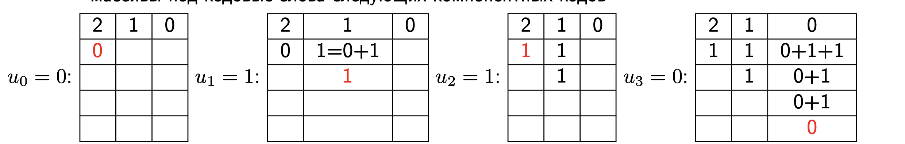

# Алгоритм последовательного исключения и декодер Тала-Варди

## Алгоритм последовательного исключения

смотри предыдущий билет.

## Частичные суммы

Сначалаа вспомним про наш списочный декодер. Обратим внимаание, что при должной реализации этот списочный декодер может быть реализован со сложность порядка ln(log n) и с объемом памяти $ln$, где $n$ - длина кода, а $l$ - размер списка.

Чтобы делать это аккуратно нужно использовать массивы для хранения частичных сум.

Вообще по сути полярный код получается путем рекурсивного применения конструкции Плотника $c = (c_1 + c_0, c_1)$
Массивы частичных сумм $C_\lambda$ размерности $2^{m-\lambda}$, $0 \leq \lambda \leq m$:

- В массиве $C_0$ размерности $2^m$ будем формировать кодовое слово $c$.
- В массиве $C_1$ размерности $2^{m-1}$ будем формировать кодовое слово $c_0$.
- $c_0$ также является кодовым словом некоторого полярного кода. Соответствующий вектор $c_{00}$ будем формировать в $C_2$.
- ...

- По готовности кодовых слов будем применять преобразование Плоткина и высвобождать массивы под кодовые слова следующих компонентных кодов.

Если у нас есть 2 пути, у которых общие значения $u_0$ и $u_1$ не нужно завадить 2 отдельных массива, содержащие 1 ($u_2$), можно завести один массив для каждого из путей и хранить указатели, которые будут показывать на один и тот же массив. Это позволяет избежать копирования данных.

При неаккуратных реализациях сложность копирвоания может оказаться больше сложности вычислений.

Если это все сделать аккуратно, то наша корректирующая способность улучшиться.

## Списочный декодер Тала-Варди

- Пусть $V[l]$ — $l$-ый вектор $u_0^{i-1}$, рассматриваемый декодером, $0 \leq l < L$.
- Пусть $R[l] = R_m^{(i-1)}(V[l], y_0^{n-1})$.

For $i = 0, 1, \ldots, 2^m - 1$:

- Вычислить $s_l = \mathcal{S}_m^{(i)}(V[l], y_0^{n-1})$, $0 \leq l < L$.
- Если $i \in \mathcal{F}$, дописать к $V[l]$ значение замороженного символа, $R[l] \leftarrow R[l] + \tau(s_l, (V[l])_i)$.
- Если $i \notin \mathcal{F}$:
  - Выбрать $L$ пар $(l, v)$ с наибольшим значением $r_{lv}$, где $r_{lv} = R[l] + \tau(s_l, v)$, $v \in \{0, 1\}$, $0 \leq l < L$.
  - Для $i$-ой выбранной пары $(l, v)$ построить продолженный путь:
    - $V'[i] \leftarrow V[l] . v$, $R'[i] \leftarrow r_{lv}$, $0 \leq i < L$.
    - $V \leftarrow V'$, $R \leftarrow R'$.

Из полученного списка выбрать наилучший путь:

- С наибольшим $R[l]$.
- Удовлетворяющий некоторым дополнительным условиям
