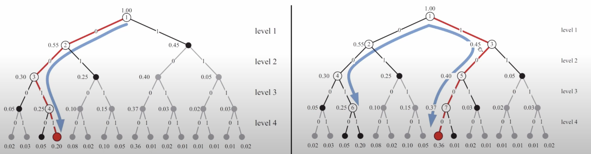

# Алгоритм последовательного исключения и декодер Тала-Варди

### Алгоритм последовательного исключения

Это про то как рботает декодер.

Декодер последовательно оценивает значения всех $\hat{u_i}$. Те, которые заморожены мы ставим им 0, которые не заморожены принимаем решение по максимуму правдоподобия.

$$
\hat{u}_i =
\begin{cases}
0, & i \in \mathcal{F}, \\
\arg \max_{u_i} W_m^{(i)}\left(y_0^{n-1}, \hat{u}_0^{i-1} \mid u_i\right), & i \notin \mathcal{F},
\end{cases}
$$

где:

- $\mathcal{F}$ — множество замороженных битов (известные значения, часто фиксируются на \( 0 \)),
- $W_m^{(i)}$ — вероятность для \( i \)-го синтетического подканала,
- $y_0^{n-1}$ — принятые символы,
- $\hat{u}_0^{i-1}$ — уже декодированные значения предыдущих битов.

Если предыдущие решения были правильными, то $\hat{u}^{i-1}_0 = u^{i-1}_0$

Если ранее была допущена ошибка, то алгоритм последовательного исключения все равно не сможет исправить.

Если строиться код с пропускной способностью близкой к пропускной способности канала, то вероятность ошибки будет такой:

$$
P \leq \sum_{i \notin \mathcal{F}} Z_{m, i} \leq 2^{-n^\beta}, \quad \beta < 0.5,
$$

где:

- $\mathcal{F}$ — множество замороженных битов,
- $Z_{m, i}$ — мера качества \( i \)-го синтетического подканала,
- $n = 2^m$ — длина кода,
- $\beta$ — параметр, определяющий скорость поляризации подканалов.

Выше один из вариантом алгоритма последоватльного исключения.

Также используя логарифмическое отношение праводоподобия полярных кодов можно получить следующий алгоритм:

$\text{For } i = 0, 1, \ldots, 2^m - 1: \hat{u}_i =
\begin{cases}
0, & i \in \mathcal{F}, \\
0, & L_m^{(i)}(y_0^{n-1}, \hat{u}_0^{i-1}) > 0, \ i \notin \mathcal{F}, \\
1, & L_m^{(i)}(y_0^{n-1}, \hat{u}_0^{i-1}) \leq 0, \ i \notin \mathcal{F}.
\end{cases}$

Логарифмическим отношением правдоподобия мы называем следующую формулу:

$$
L_m^{(i)}(y_0^{n-1}, u_0^{i-1}) = \ln \frac{W_m^{(i)}(y_0^{n-1}, u_0^{i-1} \mid 0)}{W_m^{(i)}(y_0^{n-1}, u_0^{i-1} \mid 1)}
$$

А это конструкция к которой это все сводится:

$$
L_{\lambda}^{(2i)}(y_o^{2^\lambda - 1}, u_0^{2i  - 1}) = 2\tanh^{-1}\left(\tanh\left(\frac{1}{2}L_{\lambda - 1}^{(i)}(y_{0, even}^{2^\lambda - 1}, u_{0, even}^{2i - 1} + u_{0,odd}^{2i - 1})\right)\tanh\left(\frac{1}{2}L_{\lambda - 1}^{(i)}(y_{0, odd}^{2^\lambda -  1}, u_{0, odd}^{ 2i - 1}) \right)\right)
$$

$$
L_\lambda^{(2i+1)}(y_0^{n-1}, u_0^{2^i}) = (-1)^{u_{2^i}} L_{\lambda-1}(y_0^{2^\lambda-1, even}, u_{0, even}^{2^i-1} + u_{0, odd}^{2^i-1})
+ L_{\lambda-1}(y_{0, odd}^{2^\lambda-1}, u_{0, odd}^{2^i-1})
$$

Полярные коды можно починить (у них по итогу выходит не очень большое минимальное расстояние, что дает нам такую-себе способность чет декодировать, например у кодов Рида-Маллера, которые частный случай полярных (ВНЕЗАПНО) кодов она гораздо лучше)

---

Код Рида-Маллера $\texttt{RM}(r, m)$ длины $2^m$ порядка $r$ --- полярный код с $\mathcal{F} = \{i \, | \, 0 \le i < 2^m, \text{wt}(i) < m - r\}$

Характеристики кода: $(2^m, ~~\sum_{i = m - r}^m C_m^i = \sum_{i = 0}^r C_m^i,~~ 2^{m - r})$

---

Чтобы исправить это нам нужно разобраться с причинами неудовлетворительной корректирующей способности.

Если мы возьмем алгоритм последовательного исключения, он последовательно принимает решения об каждом из символов. При этом при принятии решения относительно очередного символа он никак не учитывает информацию о том, что какие-то последующие символы могут быть заморожены. Вследствие чего принимаемые им решения оказываются **субоптимальными**. Если мы приняли такое решение, дальше мы исправить его не можем. Он (АПУ) не обеспечивает декодирование полярных кодов по максимуму правдоподобия.

Это можно исправить **списочным декодированием**.

Мы можем принимать окончательное решение относительно $u_i$ на фазе $u_i$. Мы представляем, что наши вектора $u$ представляют собой пути в каком-то дереве.

На каждой фазе $i$ будем рассматривать $L$ веткторов $u^{i-1}_0$, строить их возможные продолжения $u^i_{0}$ и выбирать из них $L$ наиболее вероятных.

Вектора $u^i_0$ задают пути в кодовом дереве.

## Частичные суммы

Сначала вспомним про наш списочный декодер. Обратим внимание, что при должной реализации этот списочный декодер может быть реализован со сложность порядка ln(log n) и с объемом памяти $ln$, где $n$ - длина кода, а $l$ - размер списка.

Чтобы делать это аккуратно нужно использовать массивы для хранения частичных сумс.

Вообще по сути полярный код получается путем рекурсивного применения конструкции Плотника $c = (c_1 + c_0, c_1)$
Массивы частичных сумм $C_\lambda$ размерности $2^{m-\lambda}$, $0 \leq \lambda \leq m$:

- В массиве $C_0$ размерности $2^m$ будем формировать кодовое слово $c$.
- В массиве $C_1$ размерности $2^{m-1}$ будем формировать кодовое слово $c_0$.
- $c_0$ также является кодовым словом некоторого полярного кода. Соответствующий вектор $c_{00}$ будем формировать в $C_2$.
- ...

- По готовности кодовых слов будем применять преобразование Плоткина и высвобождать массивы под кодовые слова следующих компонентных кодов.

Если у нас есть 2 пути, у которых общие значения $u_0$ и $u_1$ не нужно завадить 2 отдельных массива, содержащие 1 ($u_2$), можно завести один массив для каждого из путей и хранить указатели, которые будут показывать на один и тот же массив. Это позволяет избежать копирования данных.

При неаккуратных реализациях сложность копирования может оказаться больше сложности вычислений.

Если это все сделать аккуратно, то наша корректирующая способность улучшится.

## Списочный декодер Тала-Варди

Внимание, тут повляются $S_{\lambda}^{*}$ --- это пересчитанные ЛОПП (для формул $W_{\lambda}^{(2i|2i+1)} из самого начала$), только теперь ($\tilde{W}_\lambda^{(2i | 2i+1)}$) вместо суммы по $u_{i + 1}^{n - 1}$ мы берём максимум --- как бы самый вероятный путь в дереве. Также введём понятие **веса пути** $R_{\lambda}^{(i)}(u_0^i, y_0^{2^\lambda - 1}) = \ln \tilde{W}_\lambda^{(i)}(u_0^i|y_0^{2^\lambda - 1})$ 

Парочка формул для подсчёта:

> факт от Соника: если подставить $S$-ки в алгоритм последовательного исключения, то получится *декодер min-sum*

- Пусть $V[l]$ — $l$-ый вектор $u_0^{i-1}$, рассматриваемый декодером, $0 \leq l < L$.
- Пусть $R[l] = R_m^{(i-1)}(V[l], y_0^{n-1})$.

For $i = 0, 1, \ldots, 2^m - 1$:

- Вычислить $s_l = \mathcal{S}_m^{(i)}(V[l], y_0^{n-1})$, $0 \leq l < L$
- Если $i \in \mathcal{F}$, дописать к $V[l]$ значение замороженного символа, $R[l] \leftarrow R[l] + \tau(s_l, (V[l])_i)$
- Если $i \notin \mathcal{F}$:
  - Выбрать $L$ пар $(l, v)$ с наибольшим значением $r_{lv}$, где $r_{lv} = R[l] + \tau(s_l, v)$, $v \in \{0, 1\}$, $0 \leq l < L$.
  - Для $i$-ой выбранной пары $(l, v)$ построить продолженный путь:
    - $V'[i] \leftarrow V[l] . v$, $R'[i] \leftarrow r_{lv}$, $0 \leq i < L$.
    - $V \leftarrow V'$, $R \leftarrow R'$.

Из полученного списка выбрать наилучший путь:

- С наибольшим $R[l]$.
- Удовлетворяющий некоторым дополнительным условиям
