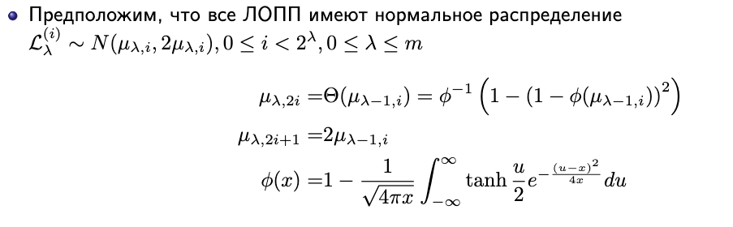
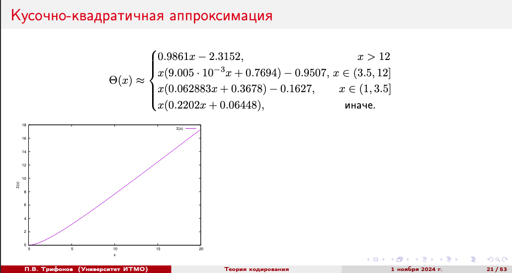
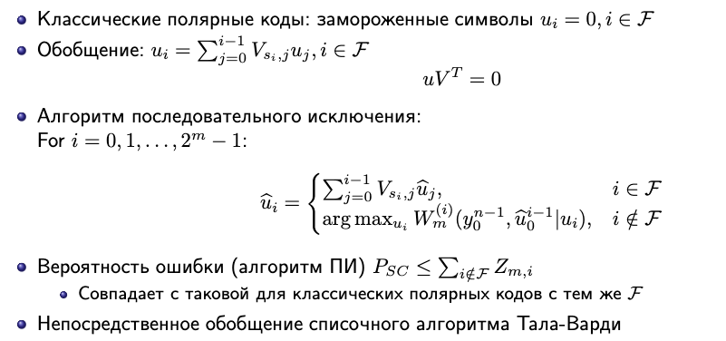
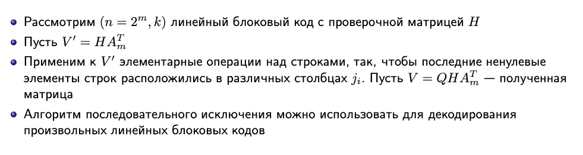
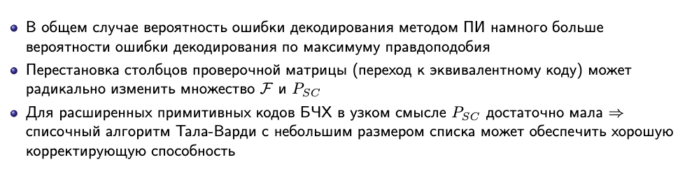
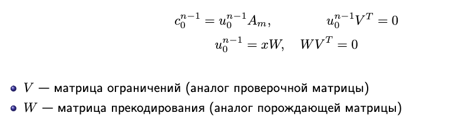
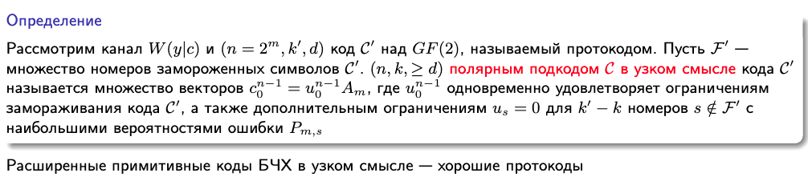
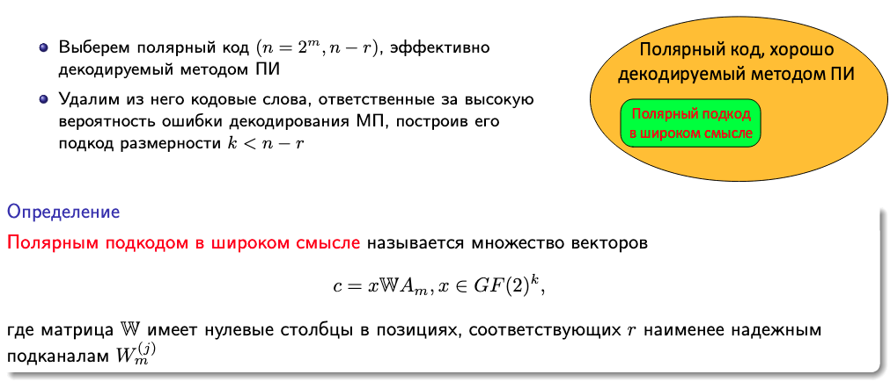

# Построение полярных кодов. Полярные коды с CRC, полярные подкоды

Как строить полярные коды $(2^m, k)$?

Мы выяснили, что замораживать стоит $2^m - k$ наименее надежных символов (например, с большими $Z_{m,i}$).

Что значит наименее надежнымии? Например, с наибольшими параметрами ХДЧ. (Оценка сверху вероятности ошибки в соотвествующем символе)

Для двоичного стриающего канала мы знаем следующую штуку:

$$Z_{m,2i} = 2Z_{m-1,i} - Z^2_{m-1, i}$$

$$Z_{m, 2_i + 1} = Z^2_{m-1, i}$$

Сложность вычисления $Z_{m,i} = O(n)$

Однако в общем случае здесь возникает нераавенство. Беда состоит в том, что в общем случае алфавит выходного канала

$$W^{(i)}_m(y^{n-1}_0, u^{i-1}_0 \mid u_i)$$

Будет иметь мощность $|\mathcal{Y}|^n2^i$

Во время построения для проивзольного канала функции переходных вероятностей это вычислительно нереализуемая задача. Размерность таблицы взявзи с мощностью очень большой.

Оказывается, что эти проблемы преодолимы.

Можно аппроксимировать канал $W^{(i)}_m$ каналом с выходным алфавитом фиксированной мощности $\mu$, который был бы чуть лучше или чуть хуже, чем истинный $W^{(i)}_m$. $Z_{m, i}$ могут быть вычислены со сложностью $O(n\mu^2\log \mu)$ согласено статье $How to contucrt Polar coded$ 2013-го года.

В чем идея?

предположим что у нас есть канал $W$ функции переходных вероятностей нашего полярного кода. Давайте пропустим это через еще один канал $V$, все это будем называть одним большим каналом $u$. Говорят, что канал $u$ будет называться в таком случае стохастически ухудшенным по отношению к каналу $W$. А канал $W$ называается стохастически улудшенным по отношению к $u$.

В статье предложили способ формировать стохастически ухудшенные и стохастически улучшенные каналы с конечным выходным полем.

Сложность этих вычислений все равно остается линейной функции относительно длины кода.

## Гауссовская аппроксимация

*Ещё один способ определить символы для заморозки*

Полярные коды --- линейные. А ещё, для симметриченых каналов вероятность ошибки не зависит от того, какое слово передавалось. Давайте промоделиуем, что переодвалось слово 0.

$$y_i = (-1)^{c_i} + \eta_i, ~~ \eta_i \sim \mathcal{N}(0, \sigma^2)$$

Подставим в ЛОПП из предыдущего билета:

$$L_0^{(0)}(y_i) = \frac{2y_i}{\sigma^2}$$

Предположим, что ЛОПП нормально распределён (типа, $y_i \sim \mathcal{N}(1, \sigma^2)$, и преобразования внутри $L$-ки никак не поменяли распределение; спойлер --- это, конечно, не так. но такое предположение даёт удивительно хорошие результаты!). Тогда:

$$M[L_0^{(0)}(y_i)] = \frac{2}{\sigma^2}, ~~ D[L_0^{(0)}(y_i)] = 2M[L_0^{(0)}(y_i)]$$

*на самом деле, предположения о параметрах этих распределений также взяты с потолка (матожидание, дисперсия). но работает также хорошо*

Выясняется, что вероятность надёжность прямо пропорциональна матожиданию ЛОПП. Поэтому давайте "заморозим" символы с наименьшим $\mu_{m, i}$

Функцию $\Theta(x)$ необязательно считать напрямую, для кодов длиной $\sim 100k$ норм работает аппроксимация:

## Полярные коды с CRC

У полярных кодов есть проблема - небольшое минимальное расстояние, вследствие чего доекодирующая способность полярного кода небольшая.

Какой есть способ улучшить это?

Давайте перед тем, как кодировать данные полярным кодом добавм к ним контрольную сумму, она называется **crc**

**CRC** или Cyclic redundacy check - циклический код, обнаруживающий ошибки.

Говоря более строго это циклические символы некоторого кода с длиной $n$ и порождающим многочленом $g(x)$, то есть это систематоческое кодирвоание циклического кода вот с такими параметрами.

В итоге формула выглядит вот так:

$$c(x) = a(x)x^{n-k} + b(x), b(x)
\equiv a(x)x^{n-k} \mod g(x)$$

В виде многочлена $b(x)$ нужно взять тот вектор, к которому мы хотим дописать нашу контрольную сумму, представить его в виде многочлена $a(x)$ и проделать вот такое преобразование.

Полезные данные представляются в виде многочлена $a(x)$

Коеффиценты многочлена $a(x)$ - те полезные данные, к котормы мы хотим дописать контрольную сумму.

Далее:

 - Добавим к данным проверочные символы $(b(x))$ перед кодированием полярным кодом
 -  при декодировании Удалим из списка, формируемого декодером Тала-Варди кодовые слова с неправильным значением контрольной суммы.

CRC используют только для обнаружения ошибок, для исправления его не используют.

$c(x)$ - кодовое слово кода, обнаруживающего ошибки.

Такая конструкция популярна, потому что проверочные символы считать можно очень просто.

$n - k$ - число проверочных символов, то есть длина контрольной суммы.

В итоге получим еще одно улучшение нашей конструкции. Уже побеждаем LDPC код.

## Динамически замороженные коды

Давайте действовать немного хитрее, и в замороженный символ подставлять не 0, а некоторую комбинацию из уже декодированных символов.

Кодирование:

Декодирование:

## Полярный подкод в узком смысле

* Давайте выберем какой-нибудь линейный блоковый код (протокод) с достаточно большим минимальным расстоянием.

* Удалим из него кодовые слова, препятствующие эффективному декодированию методом последовательного исключения.

Что для этого надо сделать? Для этого надо взять матрицу ограничений $W$, которая задает протокод, и дополнить ее некоторым количество ограничений, так, чтобы заморозить символы которые передаются по наименее надежным подканалом.

## Полярный подкод в широком смысле

