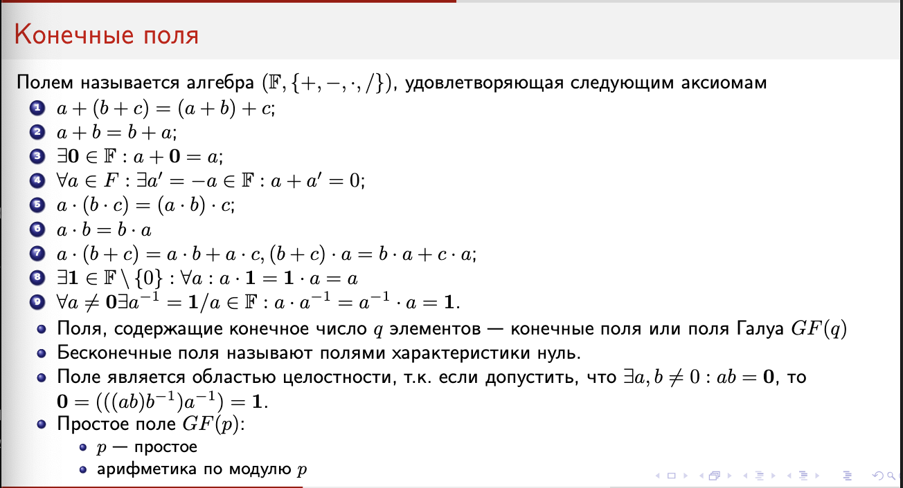
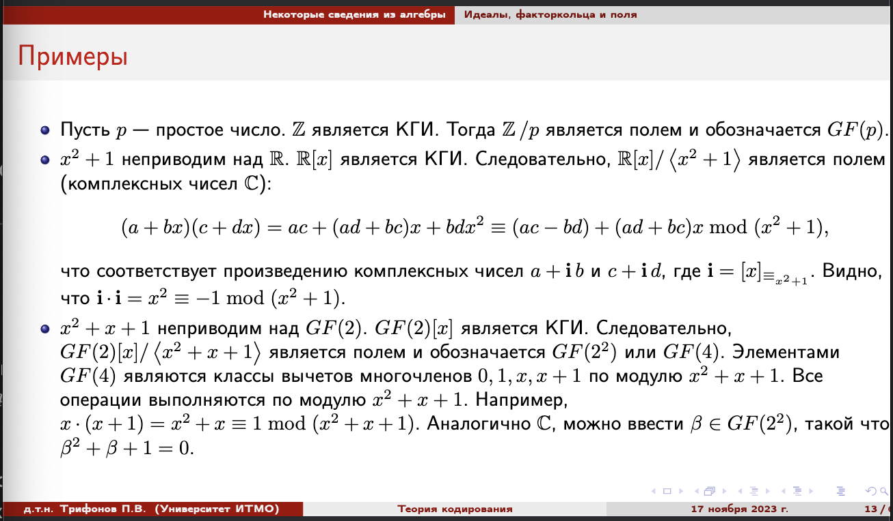

# Билет 18-old. Идеалы, факторкольца и поля

*Билет в этом году не спрашивается отдельно, так что это скорее сборник полезных алгебраических материалов про следующую теорию*

## 1. Группа

$\mathcal{G}: (G, 
cdot)$ --- группа, если:

* $\cdot$ --- ассоциативная операция $\forall a, b, c \in G: ~ (a 
\cdot b) \cdot c = a \cdot (b \cdot c)$
* существует нейтральный элемент $\text{1} \in G: \forall x \in G ~~ \text{1} \cdot x = x \cdot \text{1} = x$
* существует обратный элемент $\forall x \in G ~ \exists y \in G: ~~ x \cdot y = y \cdot x = 1$

Коммутативную группу ещё называют абелевеой, мы будем работать только с такими.

*Циклическая группа* --- каждый элемент есть возведение в степень какого-то одного другого $\exists a \in G: ~ \forall x \in G \exists n \in \mathbb{Z}: x = a^n$

Порядок **группы** --- число элементов в ней $|G|$

Порядок **элемента** --- наименьшая степень, при которой он становится нейтральным: $a \in G, n \in \mathbb{N}: a^n = 1$.

Порядок образующего элемента ($a$) конечной циклической группы $=$ порядку группы

Пусть $\mathcal{H}$ --- подгруппа абелевой группы $\mathcal{G}$. Тогда можно ввести понятие *смежного класса по подгруппе*:

$$g\mathcal{H} = \{g \cdot h | h \in H\}, g \in G$$

А ещё можно ввести отношение эквивалентности:

$$\sim_{\mathcal{H}} = \{(a, b) \in G^2 | a\mathcal{H} = b\mathcal{H}\}$$

## 2. Идеалы

**Определение (идеал).**  
Пусть $R$ — кольцо (не обязательно коммутативное). Подмножество $I \subset R$ называется *левым* (или *правым*) идеалом, если выполняются условия:

1. $(I, +)$ является подгруппой аддитивной группы $(R, +)$.
2. Для всех $r \in R$ и $x \in I$ выполняется $xr \in I$ (или $rx \in I$, соответственно).

Если $I$ является и левым, и правым идеалом, то его называют *двусторонним* идеалом (или просто идеалом).  
> В *коммутативных* кольцах любой идеал автоматически является двусторонним.

---

**Примеры идеалов.**

- В кольце целых чисел $\mathbb{Z}$ множество чётных чисел образует идеал, порождённый элементом 2: $\langle 2 \rangle$.
- В кольце многочленов $\mathbb{R}[x]$ множество многочленов, делящихся на $x^2 + 1$, образует идеал.  
- $\{0\}$ и всё кольцо $R$ всегда являются идеалами в $R$.

---

**Главный идеал.**

Идеал $I$ называется *главным*, если $I$ порождён одним элементом $a \in R$, то есть
$$
I = \langle a \rangle = \{\,r \cdot a \mid r \in R\}.
$$

---

**Максимальный идеал.**  
Идеал $I \subset R$ называется *максимальным*, если $I \neq R$ и при этом не существует идеала $J$ такого, что $I \subset J \subset R$.

---

## 2. Факторкольца

**Определение (факторкольцо).**

Пусть $R$ — кольцо и $I \subset R$ — его идеал. Бинарное отношение $\sim$ определяется так:
$$
a \sim b \quad \Longleftrightarrow \quad a - b \in I.
$$

Оно задаёт разбиение $R$ на классы эквивалентности вида
$$
[a] = a + I = \{\,a + r \mid r \in I\}.
$$

Множество всех таких классов называется *факторкольцом* $R/I$.  

В факторкольце операции определяются покомпонентно:
$$
(a + I) + (b + I) \;=\; (a + b) + I, \quad
(a + I)(b + I) \;=\; ab + I.
$$

Таким образом, $R/I$ становится кольцом.

---

**Полезные факты.**

- Если идеал $I$ является *максимальным*, то $R/I$ является **полем**.
- Если $R$ — кольцо главных идеалов (например, $\mathbb{Z}$ или $\mathrm{GF}[p](x)$), и $p$ — неприводимый элемент, то $pR$ есть максимальный идеал, а значит $R/pR$ будет полем.

---

## 3. Поля

**Определение (поле).**  
Поле $(F, +, -, \cdot, /)$ — это коммутативное кольцо с единицей $1 \neq 0$, в котором каждый ненулевой элемент имеет обратный относительно умножения. Формально, для каждого $a \neq 0$ в $F$ существует $a^{-1}$ такое, что
$$
a \cdot a^{-1} = 1.
$$

---

**Основные свойства поля.**  

- **Отсутствие делителей нуля**: если $ab = 0$ в поле $F$, то $a=0$ или $b=0$.  
- **Любое конечное поле** имеет простую характеристику (см. следующий билет).

Очень важно осознать следующие примеры про поля, особенно последний:

