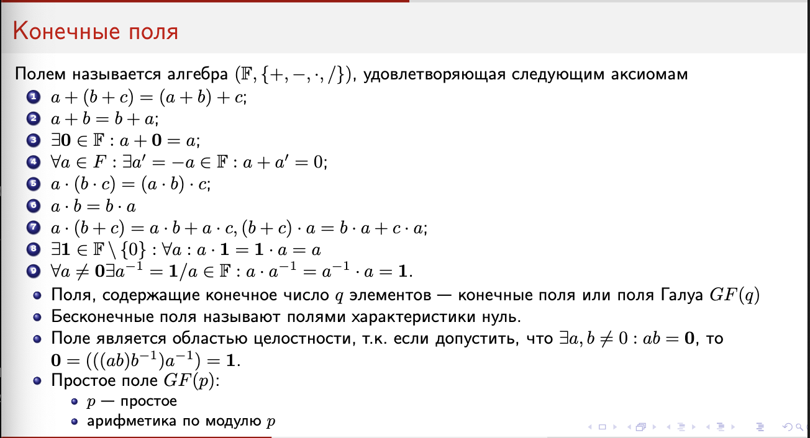

# Билет 19. Конечные поля. Характеристика поля. Число элементов в поле Галуа и его примитивный элемент. Основные свойства

## 0. Определение поля

Конечное поле == Поле Галуа $GF(p)$. Поверх простого поля Галуа можно построить расширенное (записывается как $G(p^m), m > 1$, где $m$ --- степень расширения).

Как оно строится? Утверждается, что кольцо многочленов с коэффициентами из поля Галуа является КГИ (кольцом главных идеалов; *кольцом, в котором любой идеал --- главный*). Тогда можно определить

$$GF(q^m) := GF(q)[x]_{/p(x)}$$

где $p(x)$ --- неприводимый в $GF(q)$ (то есть, его нельзя разложить на нетривиальные многочлены $\Leftrightarrow$ у него нет корня в $GF(q)$)

Элементами этого поля являются классы полиномиальных вычетов по модулю $p(x)$ (типа всевозможные остатки от деления на этот многочлен), их будет $q^m$ штук.

Ещё неочевидное замечание --- исходное поле $GF(q)$ будет являться подполем полученного расширенного поля (на первый взгляд может показаться, что это странно, ведь природа элементов этих полей разная. однако, выясняется, что можно построить изоморфизм --- то есть, правила взаимодействия с этими символами не поменялись).

## 1. Характеристика поля

**Определение (характеристика поля).**  
Характеристика поля $F$ — это наименьшее положительное целое число $p$, для которого

$$
\underbrace{1 + 1 + \dots + 1}_{p\ \text{раз}} \;=\; 0 \quad \text{в}\ F.
$$

Если такого положительного числа не существует, говорят, что характеристика равна нулю.

**Свойства характеристики.**  

- Характеристика любого конечного поля — простое число $p$.  
- Поле характеристики $p$ содержит подполе, изоморфное $\mathrm{GF}(p)$.

---

## 2. Число элементов в поле Галуа ($\mathrm{GF}(p^m)$)

**Теорема (число элементов).**  
Любое конечное поле $F$ имеет вид $\mathrm{GF}(p^m)$, где $p$ — простое (характеристика поля), а $m$ — размерность $F$ как векторного пространства над $\mathrm{GF}(p)$. Следовательно, в $F$ ровно $p^m$ элементов.

---

## 3. Примитивный элемент конечного поля

**Определение (примитивный элемент).**  
В поле $\mathrm{GF}(q)$ ($q = p^m$) все ненулевые элементы образуют мультипликативную группу порядка $q - 1$. Элемент $\alpha$ называется *примитивным*, если он порождает эту группу, то есть имеет максимальный порядок $q - 1$.

**Основные свойства.**  

- Любое конечное поле $\mathrm{GF}(q)$ содержит хотя бы один примитивный элемент.  
- Каждый ненулевой элемент поля есть некоторая степень $\alpha^k$ примитивного элемента.  

---

## 4. Основные свойства конечных полей

1. **Поле $\mathrm{GF}(p^m)$** является $m$-мерным векторным пространством над $\mathrm{GF}(p)$.
2. Мультипликативная группа $\mathrm{GF}(p^m)^{\times}$ (ненулевые элементы) циклична и имеет порядок $p^m - 1$.
3. Любой элемент расширенного поля является корнем некоторого неприводимого многочлена над $\mathrm{GF}(p)$.
4. Примитивный элемент $\alpha$ задаёт все ненулевые элементы поля как степени $\alpha^i$, $0 \le i \le p^m - 2$.
5. Порядок всякого ненулевого $\beta$ в $\mathrm{GF}(q)$ делит $q - 1$.
6. Для любого ненулевого $\beta \in GF(q)$ выполняется $\beta^{q - 1} = 1$
7. Все элементы поля $GF(q)$ удовлетворяют уравнению $x^q - x = 0$
8. В поле характеристики $p > 1$ бином Ньютона очень приятный (т. к. все внутренние элементы сравнимы с нулём по модулю $p$)