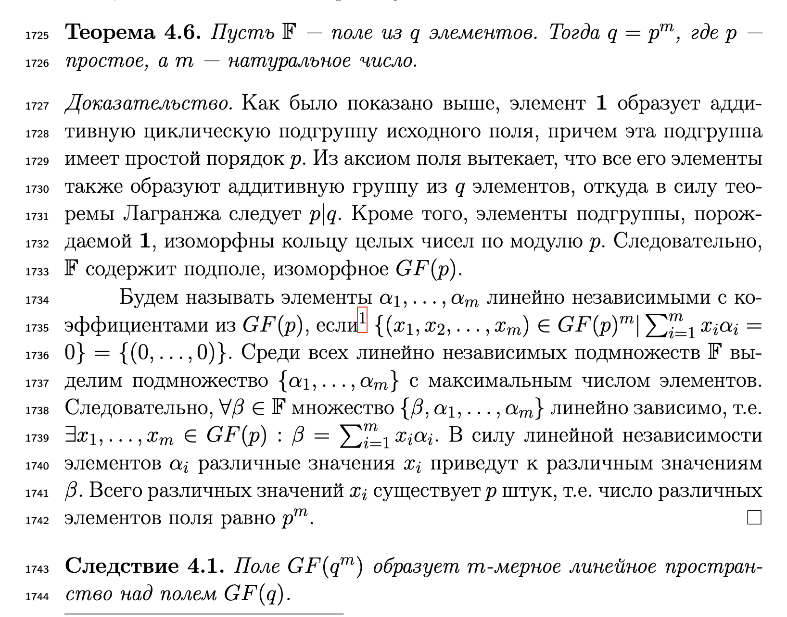

# Минимальные многочлены
Минимальный многочлен это $M_\beta(X) \in GF(p)[x]$ такой, что $\beta \in GF(p^m)$ и $M_\beta(\beta) = 0$ (среди всех многочленов с таким свойством, минимальным будет тот, у которого наименьшая степень и старший коэффициент равен 1). 

## Свойства:
1. Неприводим над $GF(p)$
   - Пруф: Если бы он был приводим, то существовало бы $M_1(x) \cdot M_2(x) = M_\beta(x) \implies \deg M_1<\deg M(x), \deg M_2<\deg M(x)$ при том, что хотя бы один из $M_i(\beta)$ был бы равен $0$. А значит, что в $GF(p)[x]$ мы только что нашли многочлен меньшей степени, чем $M_\beta(X)$, что нарушает определение.
2. Если существует какой-то $f(x) \in GF(p)[x] : f(\beta) = 0$, то $f(x)$ делится на $M_\beta(x)$
   - Пруф: $f(x) = q(x) \cdot M_beta(x) + r(x)$. При подстановке $f(\beta) = q(x) \cdot 0 + r(x) = 0$, тогда и остаток $r(x) = 0$.
3. (следствие 2) $(x^{p^m} - x)$ делится на $M_\beta(x)$
4. $\deg M_\beta(x) \le m$
   - Пруф: Можно всегда построить $M(x) \in GF(p)[x] : M(\beta) = 0$ при $\deg M(x) = m$. Делается это вот так: $GF(p^m)$ - линейное пространство над $GF(p)$, тогда любые $m + 1 элемент $GF(p^m)$ линейно зависимы. Тогда для нашего $\beta$ мы можем найти $m$ коэффициентов $a_i$, что $\sum a_i \beta^i = 0$. Тогда $M(x) = \sum_{i=0}^{m} a_i x^i$ и есть искомый многочлен.
5. Если $\beta$ - примитивный элемент $GF(p^m)$, то степень его минимального многочлена равна $m$.
   - Пруф: (не знаю валидный ли, сам его придумал). Если $\beta$ примитивный элемент, что любой другой элемент поля может быть получен как $\beta^i, i \in \mathbb{N}$. Это значит, что любой элемент поля должен быть корнем $M_\beta$, а таких элементов $m$, а значит у $M_\beta$ степень $m$.
6. (*определение*): минимальный многочлен примитивного элемента называется *примитивным*.
7. ACHTUNG: не все неприводимые многочлены являются примитивными
8. В $GF(p^m)$ существует примитивный элемент $\alpha$, который является корнем примитивного многочлена $\pi(x) \in GF(p)[x]$ (неразложимого в нём). Значит, набор $(
\alpha^0, \ldots, \alpha^{m - 1})$ --- ЛНЗ, и является базисом в $GF(p^m)$ (которое есть линейное пространство над $GF(p)$, доказательство см. ниже).
 

   Тогда $\forall \beta \in GF(q^m): \beta = \sum_{i = 0}^{m - 1}b_{\beta, i}\alpha^{i}, ~~ b_{\beta, i} \in GF(q)$ (все элементы из расширенного поля могут быть разложены в вектора с элементами из исходного поля). 

9. Минимальные многочлены элементов $\beta \in GF(q^m)$ и $\beta^p$ совпадают.

   Элементы поля, имеющие одинаковый примитивный многочлен, назвыаются **сопряжёнными**. Раз уж можно искать такие элементы, возводя в степень $p$, давайте определим факторизацию поля по отнощению сопряжённости. Для этого введём *циклотомический класс*: 
   
   Пусть у нас есть $\beta$ и мы знаем для него минимальный многочлен. Т.к. у нас есть примитивный элемент и мультипликативная группа, $\exists s: \alpha^s = \beta$. А ещё вычислим такое минимальное $m_s: p^{m_s}s = s \mod p^m - 1$. Тогда набор степеней:

   $$C_s = \{s, ps, p^2s, \ldots, p^{m_s}s\}$$

   называется **циклотомическим классом** (элементы класса получаются возведением $\alpha$ в эти степени). $s$ --- представитель класса.

   Утверждается, что такие классы дизъюнктно делят множество степеней примитивного элемента поля ($\Leftrightarrow$ как и сами элементы поля).

   Минимальные многочлены можно **строить**, для этого достаточно посчитать циклотомические классы и вычислить:

   $$M_s(x) = \Pi_{j \in C_s}(x - \alpha^j)$$

   legacy:
    
   При поиске порождающего многочлена БЧХ мы пользуемся ровно этим свойством, перемемножая все $x-\alpha^i$ где $i \in C_i$ и у нас по построению получается минимальный многочлен. А почему он минимальный? Потому что он имеет ровно ту степень, сколько корней должен иметь в рамках существующих степеней $\beta^i$ (начиная с какой-то степени эти числа зациклятся и мы снова получим $\beta$)
