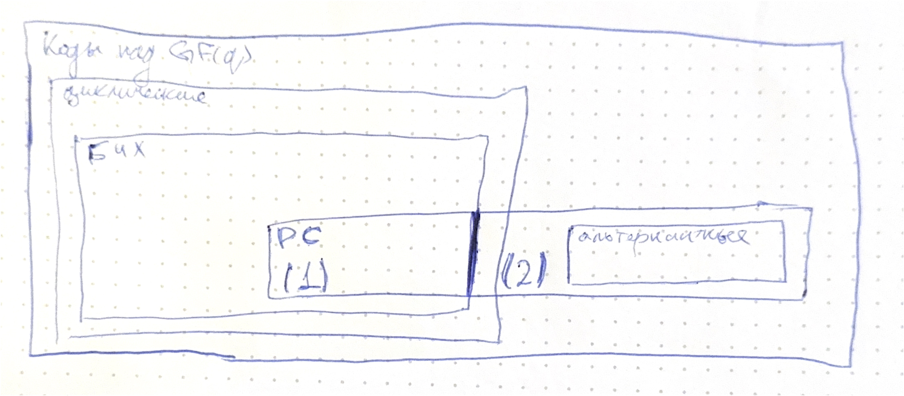

# Коды Рида-Соломона и обобщенные коды Рида-Соломона

> Данный билет является продолжение [21](T21.md)-ого билета, перед прочтением этого рекомендуется прочитать предыдущий.

**(1)**

**Код Рида-Соломона** - это код БЧХ длины $q - 1$ над полем $\mathrm{GF}(q)$.

* *Минимальным многочленом* элемента $\beta \in \mathrm{GF}(q)$ над полем $\mathrm{GF}(q)$ (два независимых поля) является: $M_\beta(x) = x - \beta$.
* *Порождающий многочлен* кода Рида-Соломона: $g(x) = \displaystyle\prod_{i = 0}^{\delta - 2}{\left(x - \alpha^{b + i}\right)}$.
* *Размерность кода* Рида-Соломона: $k = n - \delta + 1$.
* *Минимальное расстояние* кода Рида-Соломона больше или равно чем конструктивное: $d \geqslant \delta$.
* Заметим, что по границе Синглтона выходит, что *минимальное расстояние у линейного блокового кода* ограничено $(n - k + 1)$, то есть $d \leqslant n - k + 1$. А поскольку $k = n - \delta + 1 \implies \delta = n - k + 1$ и с учётом, что $d \geqslant \delta$, наконец, выходит, что $d = n - k + 1$.

Код Рида-Соломона является кодом с *максимальным достижением расстоянием*. Это означает, что этот код достигает максимального возможного *кодового расстояния* (минимальное количество позиций, в которых отличаются два разных кодовых слова) для заданной длины кода и размера алфавита.

---

Оказывается, что построенный нами класс РС-кодов является лишь частным случаем более общих "обобщённых" кодов РС. Чтобы к ним подступиться, рассмотрим теорему:

*Кодирование кодом Рида-Соломона как вычисление значений многочлена.*

**Теорема**. Пусть у нас есть кодовое слово $c = (c_0, \ldots, c_{n - 1})$ кода Рида-Соломона над полем $\mathrm{GF}(q)$ в узком смысле (то есть, когда $b = 1$) то оно является таковым (в смысле, что $c$ - кодовое слово) тогда и только тогда, когда все $c_i$ являются значениями многочлена $f$ (степень которого меньше $k$, то есть $\deg{f} < k$) в точках $\alpha^{i}$, то есть:

$$
  c_i = f(\alpha^i), ~ 0 \leqslant i < n, ~ f(x) \in \mathrm{GF}(q)[x]
$$

*Значение теоремы*. Связь с интерполяцией: эта теорема подчеркивает, что каждое кодовое слово кода Рида-Соломона соответствует интерполяции многочлена $f(x)$ через фиксированное количество точек.

Декодирование: ищем по парам $(c_i, a_i) \rightarrow f_i$ интерполяционным многочленом Лагранжа (?).

Многочлен $f(x)$ в кодах Рида-Соломона *берется из исходных данных*, которые мы хотим закодировать. Другими словами, это множество таких многочленов, подходящих под информационные данные.

---

Ещё одно **определение кодов Рида-Соломона**. Под $(n, k, n - k + 1)$ кодом Рида-Соломона можно также понимать множество векторов значений $c = (c_0, \ldots, c_{n - 1})$ многочленов $f$ в различных точках $a_i$, то есть $c_i = f(a_i)$, где $\deg{f(x)} < k$, $f(x) \in \mathrm{GF}(q)[x]$, $a_i \in \mathrm{GF}(q)$ - локаторы.

* *Минимальное расстояние* действительно равно $(n - k + 1)$.
* В общем случае, мы получаем код, который не является ни кодом БЧХ, ни циклическом кодом - простой какой-то код. И только в том случае, если $a_i = \alpha^i$, то тогда получается код Рида-Соломона (циклический) в узком смысле, где $\alpha$ - примитивный корень степени $n$ из $1$.

*Зачем нужно это определение*: это определение обобщает идею кодов Рида-Соломона, подчеркивая, что локаторы $a_i$ могут быть любыми элементами поля $\mathrm{GF}(q)$, а не обязательно последовательными степенями какого-либо примитивного элемента.

---

**(2)**

**Обобщенным кодом $(n, k, d = n - k + 1)$ Рида-Соломона $\mathrm{GRS}(n, k, a, u)$** понимается множество векторов, компоненты которых получаются как произведение значений многочлена $f$, в каких-то точках $a_i$, на какие-то фиксированные коэффициенты $u_i$, то есть: вектора $(c_0u_0, \ldots, c_{n - 1}u_{n - 1})$, где $(c_0, \ldots, c_{n - 1})$ - кодовое слово $(n, k, n - k + 1)$ кода Рида-Соломона (или, вдохновляясь предыдущим определением $c_i = f(a_i)$), где $\deg{f(x)} < k$, $a_i$ - различные и $u_i$ - ненулевые.

Для их декодирования могут использоваться те же алгоритмы, что и для обычных кодов Рида-Соломона.

*Зачем они вообще нужны*: на основе обобщенных кодов Рида-Соломона строятся также другие коды.

Итоговая иерархия рассмотренных кодов:

---

Интересные факты: используются в QR-кодах, кодирований Blu-Ray дисков, и вообще --- очень популярный класс кодов!
