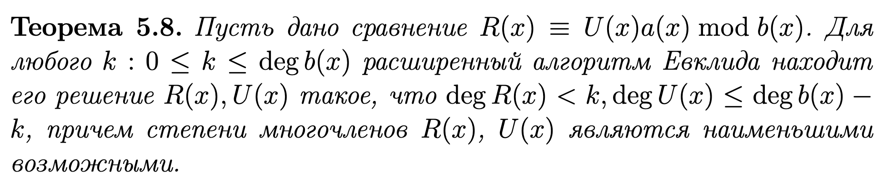
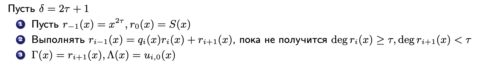
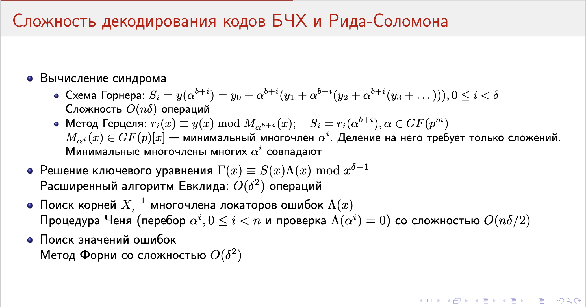

# Ключевое уравнение декодирования кодов БЧХ. Алгоритм Форни. Декодирование с помощью алгоритма Евклида

> Данный билет является продолжение [23](T23.md)-его. Перед прочтением этого, рекомендуется прочитать предыдущий.

По познаниям из 23-го билета мы знаем, что синдромы связаны с локаторами и значениями ошибок следующим образом:

$$
  S_i = \sum_{l = 1}^{t}{\left(E_lX_l^{b + i}\right)}, ~ 0 \leqslant i < \delta - 1
$$

Давайте компоненты вектора синдрома упакуем в многочлен:

$$
  S_i = \sum_{l = 1}^{t}{\left(E_lX_l^{b + i}\right)} \to S(x) = \sum_{l = 0}^{\delta - 2}{\left(S_ix^i\right)}
$$

Здесь, в правой части, мы снова подставляем то, что знаем про $S_i$ и группируем по степеням $x$:

$$
  \begin{aligned}
  S(x) &= \sum_{l = 0}^{\delta - 2}{\left(S_ix^i\right)} \\
  &= \sum_{l = 1}^{t}{\left(E_lX_l^b\textcolor{red}{\sum_{i = 0}^{\delta - 2}{\left(\left(X_lx\right)^i\right)}}\right)}
  \end{aligned}
$$

Теперь рассмотрим многочлен $1 - \left(X_lx\right)^{\delta - 1}$ - его можно разложить на множители следующим образом:

$$
  1 - \left(X_lx\right)^{\delta - 1} = \left(1 - X_lx\right) \left(\sum_{i = 0}^{\delta - 2}{\left(\left(X_lx\right)^i\right)}\right)
$$

А теперь приведём его по модулю $x^{\delta - 1}$: у нас была в левой части $x^{\delta - 1}$ - что будет, если взять остаток от деления на $x^{\delta - 1}$? - $1$. А это значит, что:

$$
  \left(1 - X_lx\right) \left(\sum_{i = 0}^{\delta - 2}{\left(\left(X_lx\right)^i\right)}\right) \equiv 1 \operatorname{mod} x^{\delta - 1}
$$

Продолжая преобразовывать, давайте вынесем в правую часть также всё, что не относится к сумме, то есть:

$$
  \textcolor{red}{\sum_{i = 0}^{\delta - 2}{\left(\left(X_lx\right)^i\right)}} \equiv \dfrac{1}{1 - X_lx} \operatorname{mod} x^{\delta - 1}
$$

Но ведь выделенное $\textcolor{red}{красным}$ уже было сверху (также выделено $\textcolor{red}{красным}$), а значит:

$$
  S(x) \equiv \sum_{l = 1}^{t}{\left(\dfrac{E_lX_l^b}{1-X_lx}\right)}\operatorname{mod}x^{\delta - 1},
$$

то есть синдром сравним левой части по модулю $x^{\delta - 1}$.

Наконец, введем ещё один *многочлен значений ошибок* $\Gamma(x) = \displaystyle\sum_{l = 1}^{t}{\left(E_lX_l^b\textcolor{yellow}{\prod_{j \neq l}{\left(1-X_jx\right)}}\right)}$. Посмотрим повнимательнее на $\textcolor{yellow}{выделенное}$ и вспомним про *многочлен локаторов ошибок* $\Lambda(x) = \textcolor{yellow}{\prod_{l = 1}^{t}{\left(1 - X_lx\right)}}$. Сравним их по модулю $x^{\delta - 1}$ и получим:

$$
  \Gamma(x) = \displaystyle\sum_{l = 1}^{t}{\left(\textcolor{blue}{E_lX_l^b}\textcolor{yellow}{\prod_{j \neq l}{\left(1-X_jx\right)}}\right)} \equiv \textcolor{yellow}{\Lambda(x)}\sum_{l = 1}^{t}{\left(\dfrac{\textcolor{blue}{E_lX_l^b}}{1-X_lx}\right)}
$$

Внимательно посмотрим на *самый правую сумму* - это только что выраженный синдром $S(x)$:

$$
  \begin{cases}
    S(x) &\equiv \sum_{l = 1}^{t}{\left(\dfrac{E_lX_l^b}{1-X_lx}\right)}\operatorname{mod}x^{\delta - 1} \\
    \Gamma(x) &\equiv \Lambda(x) \sum_{l = 1}^{t}{\left(\dfrac{E_lX_l^b}{1-X_lx}\right)} \operatorname{mod}x^{\delta - 1}
  \end{cases} \implies \boxed{\Gamma(x) \equiv \Lambda(x)S(x) \operatorname{mod} x^{\delta - 1}}
$$

То, что выделено - это и есть **ключевое уравнение декодирования кодов БЧХ**.

---

**Алгоритм Форни быстрого поиска значений ошибок**. Сложность: $\mathcal{O}(n^2)$.

$$
  E_i = \dfrac{X_i^{-b}\Gamma(X_i^{-1})}{\prod_{j\neq i}{\left(1 - X_jX_i^{-1}\right)}}, ~ 1 \leqslant i < t
$$

---

Также продолжая 23-ий билет, здесь и далее мы хотим решить проблему с четвертой степени при подборе $t$ (количество коэффициентов многочлена локатора ошибок) и решения СЛАУ при декодировании БЧХ с алгоритмом ПГЦ.

Оказывается, эту степень можно уменьшить с помощью **алгоритма Евклида**. Говорят, что если есть многочлены $a(x)$ и $b(x)$, то их НОД можно найти с помощью этого алгоритма. Работает он так:

1. Инициализируем многочлены $r_{-1}(x) \gets a(x)$, $r_0(x) \gets b(x)$.
2. Делим одно на другое, пока не дойдем до нулевого остатка:

    $$
      r_{i - 1}(x) = q_i(x)r_i(x) + r_{i + 1}(x),
    $$

    где $\deg{(r_{i + 1}(x))} < \deg{(r_i(x))}$.

3. Последний ненулевой остаток $r_i(x)$ - НОД.

Заметим, что данный алгоритм можно представить с помощью преобразования матриц:

$$
  \begin{pmatrix} r_i(x) & r_{i - 1}(x) \end{pmatrix}
  \cdot
  \begin{pmatrix}
    -q_i(x) & 1 \\
    1       & 0
  \end{pmatrix}
  =
  \begin{pmatrix} r_{i + 1}(x) & r_i(x) \end{pmatrix}
$$

Заметим, что мы на каждом шаге оригинального алгоритма выполняли одно и то же действие, а значит и здесь мы также умножаем $i+1$ *полученную матрицу* на матрицу $\begin{pmatrix}-q_i(x) & 1 \\ 1 & 0\end{pmatrix}$. То есть, если мы запишем этот алгоритм начиная с нулевого шага, то получим:

$$
  \begin{aligned}
    \begin{pmatrix} r_{i + 1}(x) & r_i(x) \end{pmatrix}
    &=
    \begin{pmatrix} r_i(x) & r_{i - 1}(x) \end{pmatrix}
    \cdot
    \begin{pmatrix}
      -q_i(x) & 1 \\
      1       & 0
    \end{pmatrix}
    \\
    &=
    \begin{pmatrix} r_0(x) & r_{-1}(x) \end{pmatrix}
    \cdot
    \underbrace{
    \begin{pmatrix}
      -q_0(x) & 1 \\
      1       & 0
    \end{pmatrix}
    \cdot
    \begin{pmatrix}
      -q_1(x) & 1 \\
      1       & 0
    \end{pmatrix}
    \cdot
    \ldots
    \cdot
    \begin{pmatrix}
      -q_i(x) & 1 \\
      1       & 0
    \end{pmatrix}
    }_{\text{упростим запись}} \\
    &=
    \underbrace{\begin{pmatrix} \underbrace{r_0(x)}_{b(x)} & \underbrace{r_{-1}(x)}_{a(x)} \end{pmatrix}}_{\text{подставим многочлены}}
    \cdot
    \underbrace{
    \prod_{i}{\begin{pmatrix}
      -q_i(x) & 1 \\
      1       & 0
    \end{pmatrix}}
    }_{U(x) ~- \text{так переименуем}} \\
    &=
    \begin{pmatrix} b(x) & a(x) \end{pmatrix}
    \cdot
    U(x) \\
    &\implies \boxed{\begin{pmatrix} b(x) & a(x) \end{pmatrix} \cdot U(x) = \begin{pmatrix}0 & \gcd{\left(a(x), b(x)\right)}\end{pmatrix}}
  \end{aligned}
$$

Пояснение про последнее преобразование: мы "раскрутили" алгоритм до последнего шага, когда $r_i(x)$ *по определению выше* становится последним ненулевым остатком, то есть НОДом, и, соответственно, так и получили: где стояло значение $r_{i + 1}(x)$ - теперь $0$, а в соответствующей позиции $r_i(x)$ - теперь $\gcd$ двух многочленов.

То, что мы получили называется **расширенным алгоритмом Евклида**.

**Теорема**. Существуют многочлены $u(x)$, $v(x)$, что

$$
  b(x)u(x) + a(x)v(x) = \gcd{(a(x), b(x))}
$$

Перечислим **свойства расширенного алгоритма Евклида**. Для начала, рассмотрим $U_j(x) = \prod_{i = 0}^{j}{\begin{pmatrix}-q_i(x) & 1 \\ 1 & 0\end{pmatrix}}$, то есть тот же $U(x)$, что и выше, только теперь мы смотрим на произведение первый $j$ матриц. Теперь выделим отсюда - из произведения - последнюю матрицу $U_i$ и тогда: $U_j(x) = U_{j - 1} \cdot \underbrace{\begin{pmatrix}-q_j(x) & 1 \\ 1 & 0\end{pmatrix}}_{Q_j(x) ~- \text{переименовали}}$, рассмотрим это произведение повнимательнее:

$$
  \begin{aligned}
    U_{j - 1} \cdot \begin{pmatrix}-q_j(x) & 1 \\ 1 & 0\end{pmatrix} &= \begin{pmatrix}u_{0, 0} & u_{0, 1} \\ u_{1, 0} & u_{1, 1} \end{pmatrix} \cdot \begin{pmatrix}-q_j(x) & 1 \\ 1 & 0\end{pmatrix}, ~ u_{y, x} \in U_{j - 1} \\
    &= \begin{pmatrix}\underbrace{u_{0, 0} \cdot (-q_j(x)) + u_{0, 1}}_{\text{элемент из матрицы}~U_{j}} & \underbrace{u_{0, 0}}_{\text{элемент из матрицы}~U_{j - 1}} \\ \underbrace{u_{1, 0} \cdot (-q_j(x)) + u_{1, 1}}_{\text{элемент из матрицы}~U_{j}} & \underbrace{u_{1, 0}}_{\text{элемент из матрицы}~U_{j - 1}}\end{pmatrix} \\
    &= \begin{pmatrix}u_{j, 0}(x) & u_{j - 1, 0}(x) \\ u_{j, 1}(x) & u_{j - 1, 1}(x)\end{pmatrix}
  \end{aligned}
$$

Заметим, что матрица $U_j(x)$ состоит условно из двух частей: "левая" часть (первый столбец) состоит из элементов непосредственно этой матрицы, а "правая" часть (второй столбец) состоит из непосредственных элементов матрицы $U_{j - 1}(x)$. Соответственно, первый индекс элемента $u_{j, 0}(x)$ - это номер матрицы $U_j$, а второй - это строка (столбцы соответствующие). Тогда, получается, что $U_{-1}(x) = \begin{pmatrix}1 & 0 \\ 0 & 1\end{pmatrix}$. И таким образом, принимая новое обозначение, наше произведение выглядит на самом деле:

$$
  \begin{aligned}
    U_{j - 1} \cdot \begin{pmatrix}-q_j(x) & 1 \\ 1 & 0\end{pmatrix} &= \begin{pmatrix}u_{j - 1, 0}(x) & u_{j - 2, 0}(x) \\ u_{j - 1, 1}(x) & u_{j - 2, 1}(x) \end{pmatrix} \cdot \begin{pmatrix}-q_j(x) & 1 \\ 1 & 0\end{pmatrix} \\
    &= \begin{pmatrix}u_{j - 1, 0}(x) \cdot (-q_j(x)) + u_{j - 2, 0}(x) & u_{j - 1, 0}(x) \\ u_{j - 1, 1}(x) \cdot (-q_j(x)) + u_{j - 2, 1}(x) & u_{j - 1, 1}(x)\end{pmatrix} \\
    &= \begin{pmatrix}u_{j, 0}(x) & u_{j - 1, 0}(x) \\ u_{j, 1}(x) & u_{j - 1, 1}(x)\end{pmatrix}
  \end{aligned}
$$

Применим аналогичные рассуждения к $a(x)$ и $b(x)$ и перемножим их с $U_j(x)$:

$$
  \begin{pmatrix}
    r_0(x) & r_{-1}(x)
  \end{pmatrix}
  \cdot
  \begin{pmatrix}
    u_{j, 0}(x) & u_{j - 1, 0}(x) \\
    u_{j, 1}(x) & u_{j - 1, 1}(x)
  \end{pmatrix}
  =
  \begin{pmatrix}
    r_{j + 1}(x) & r_j(x)
  \end{pmatrix}
$$

А теперь рассмотрим **свойства**:

1. Что такое $\deg{u_{j, 0}(x)}$? По построению умножения выше это - $\max{\left((\deg{u_{j, 0}(x)} + \deg{q_{j}(x)}), ~ \deg{u_{j - 2, 0}(x)}\right)}$, тогда

    $$
      \deg{u_{j, 0}(x)} = \deg{u_{j - 1, 0}(x)} + \deg{q_{j}(x)}
    $$

    Теперь последовательно раскроем сумму от $\deg{u_{j - 1, 0}(x)}$ - это те же $q$'шки - и получим, что это на самом деле сумма $q$:

    $$
      \begin{aligned}
        \deg{u_{j, 0}(x)} &= \deg{u_{j - 1, 0}(x)} + \deg{q_{j}(x)} \\
        &= \sum_{i = 0}^{j}{\deg{q_i(x)}}
      \end{aligned}
    $$

    Эти же степени $q$ равны в свою очередь разностям степеней остатков, так как - $r_{i - 1}(x) = q_i(x)r_i(x) + r_{i + 1}(x)$ - степень у $q_i(x)$ можно выразить, разделив $r_{i - 1}(x)$ на $r_i(x)$ - разность:

    $$
      \begin{aligned}
        \deg{u_{j, 0}(x)} &= \deg{u_{j - 1, 0}(x)} + \deg{q_{j}(x)} \\
        &= \sum_{i = 0}^{j}{\deg{q_i(x)}} \\
        &= \sum_{i = 0}^{j}{\left(\deg{r_{i - 1}(x)} - \deg{r_i(x)}\right)} = \deg{r_{-1}(x) - \deg{r_j(x)}} & \text{(раскрыли сумму)}
      \end{aligned}
    $$

2. Теперь интереса ради мы посчитаем определитель матрицы $U_j(x)$:

    $$
      \det{U_j(x)} = \det{\begin{pmatrix} u_{j, 0}(x) & u_{j - 1, 0}(x) \\ u_{j, 1}(x) & u_{j - 1,1}(x) \end{pmatrix}} = u_{j, 0}(x)u_{j - 1, 1}(x) - u_{j - 1, 0}(x)u_{j, 1}(x)
    $$

    Опять же вспоминаем, что $U_j(x)$ - это произведений матриц $Q(x)$ - и потому:

    $$
      \det{U_j(x)} = \prod_{i = 0}^{j}{\det{Q_j(x)}} = \prod_{i = 0}^{j}{\left(\det{\begin{pmatrix}-q_i(x) & 1 \\ 1 & 0\end{pmatrix}}\right)} = (-1)^{j + 1}
    $$

3. Утверждается, что $\gcd{\left(u_{j, 0}(x), ~ u_{j, 1}(x)\right)} = 1$.
4. Утверждается, что $r_{j + 1}(x) = r_0(x)u_{j, 0}(x) + r_{-1}(x)u_{j, 1}(x)$. Это исходит из:

    $$
      \begin{pmatrix}
        r_0(x) & r_{-1}(x)
      \end{pmatrix}
      \cdot
      \begin{pmatrix}
        u_{j, 0}(x) & u_{j - 1, 0}(x) \\
        u_{j, 1}(x) & u_{j - 1, 1}(x)
      \end{pmatrix}
      =
      \begin{pmatrix}
        r_{j + 1}(x) & r_j(x)
      \end{pmatrix}
    $$

    Также, если мы возьмем по модулю $r_{-1}(x)$ это утверждение:

    $$
      r_{j + 1}(x) = r_0(x)u_{j, 0}(x)\operatorname*{mod}r_{-1}(x),
    $$

    то мы получим выражение подозрительно напоминающее *ключевое уравнение кодов БЧХ*.

5. Утверждается, что $\gcd{\left(r_{j + 1}(x), ~ u_{j, 0}(x)\right)} = \gcd{\left(r_{-1}(x), ~ u_{j, 0}(x)\right)}$.

---

Нахождение многочленов $\Gamma(x)$ и $\Lambda(x)$ может быть реализовано **алгоритмом Сугиямы** с применением расширенного алгоритма Евклида.

То есть, берём ключевое уравнение декодирования кодов БЧХ, и по $S(x)$ получаем расширенным алгоритмом Евклида $\Gamma(x), \Lambda(x)$:

Алгоритм точно когда-то заканчивается, т. к. степени остатков убывают на каждом шаге.

Сложности полученных алгоритмов: 

Напомним, что корни многочлена локатора ошибок проще всего искать перебором по всем элементам из поля (процедура Ченя).