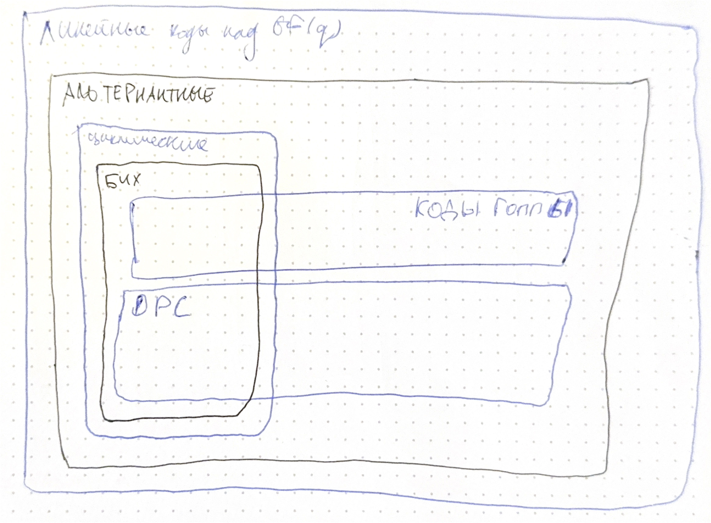

# Альтернантные коды. Коды Гоппы. Криптосистема Мак-Элиса

## Альтернантные коды

Если $GRS$ не является циклическим, то он является альтернантным кодом. 

В лекции было опущено, но есть следующая теорема:

По определению, *альтернантный код* **над $GF(q)$** $\mathcal{A}(n, r, a, u)$ это код с проверочной матрицей кода $GRS(n, n - r, a, v)$ (дуального к $GRS(n, r, a, u)$)

Причём важно, что элементы $H$ берутся из расширенного поля (а не из простого, как в $GRS$), но множество кодовых слов есть $GRS(n, n - r, a, v) \cap GF(q)^n$. Фактически, это такой аналог кодов БЧХ, только необязательно циклических (собственно, БЧХ есть подвид алтернантных).

Матрицу можно перестроить в простое поле, заменив элементы на векторное представление. Размерность варьируется из-за того, что вектора в проверочной матрице могут оказаться ЛЗ. В худшем случае, размерность равна $n - mr$. В лучшем --- $n - r$.

Выясняется, что среди альтернантных кодов есть *асимптотически хорошие*, то есть такие, что при увеличении длины $n \rightarrow \infty$:

* скорость $R = \frac{k}{n} \rightarrow R' > 0$
* относительное расстояние $\frac{d}{n} \rightarrow \delta' > 0$

Можно доказать, что коды БЧХ не такие. Также, соответствие границе Варшамова-Гильберта говорит об асимптотической хорошести кода.

Некоторые альтернантные коды ей соответствуют.

## Коды Гоппы

Рассмотрим подмножество альтернантных кодов --- коды Гоппы

Фактически, это такой же альтернантный код, только с известной структурой вектора $u$: вводится многочлен Гоппы $G(x)$, и $u = (\frac{1}{G(a_1)}, \ldots, \frac{1}{G(a_{n - 1})})$

Проверочная матрица предтавлена на слайде:

Интересно также посмотреть на двоичные коды Гоппы. Можно доказать, что тогда существует $Q(x)$ --- полный квадрат наименьшей степени, делящийся на $G(x)$, и его можно использовать для улучшения оценки минимального расстояния:

$$d \geq \deg Q(x) + 1 \geq \deg G(x) + 1$$

Если же $$G(x)$$ свободен от квадратов (то есть него разложение на неприводимые многочлены имеет только сомноители степени 1), то $Q(x) = G(x)^2$ и $d \geq 2\deg Q(x) + 1$, и такие коды называются *сепарабельными кодами Гоппы*.

## Криптосистема Мак-Элиса

Рассматривается классическая задача в криптографии о передаче сообщения по незащищённому каналу. Традиционные решения с шифрованием, основанным на фактах из теории чисел (разложения чисел и тд), становятся менее надёжными из-за развития квантовых компьютеров (которые умеют очень быстро перебирать варианты, на порядки быстрее, чем обычные компьютеры).

Например, был приведён пример, что квантовые компьютеры уже научились за вменяемое время раскладывать на множители числа порядка $2^40 \simeq 10^{12}$. Поэтому сейчас человечеством разрабатываются новые подходы для шифрования сообщений.

Одним из таких как раз и является криптосистема Мак-Элиса, предложенная ещё в 1978 году. Берём какой-нибудь код, ошибки которого мы умеем исправлять. Тогда открытым ключом будет $(\Gamma = QGP, t)$, где $Q$ --- обратимая матрица, $P$ --- перестановочная, а $t$ --- количество ошибок, которое мы вносим. Секретный --- $Q, P$. 

Берём сообщение, кодируем, и к кодовому слову добавляем рандомные $t$ ошибок. Отправляем по незащищённому каналу, на стороне приёмника декодируем, используя знания о секретном ключе.

Сложность декодирования без знания секретного ключа заключается в том, что декодирование произвольного линейного кода --- NP-полная задача.

Также, не все коды подходят для такой системы. Доказано, что для обобщённых кодов Рида-Соломона можно просто (за полиномиальное время) найти секретный ключ по открытому.

Зато, для таких целей отлично подходят только что изученные коды Гоппы, их много, и 

В лекции ещё есть кусочек про согласование:

