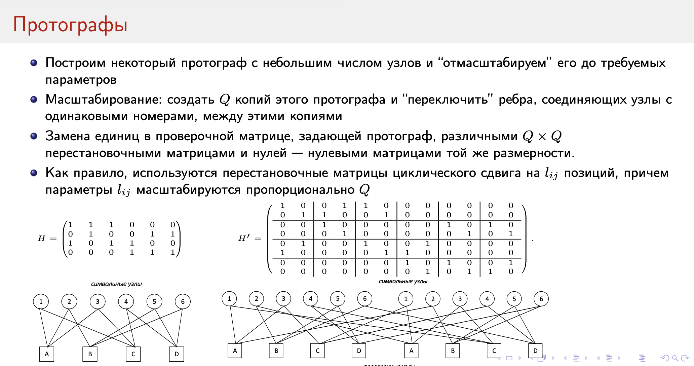

# Низкоплотностные коды. Основные характеристики. Конструкции низкоплотностных кодов

*они же --- МППВ, коды малой плотности проверки на чётность*

Низкоплотностные коды --- подвид линейных блоковых кодов, имеющих "разреженную" проверочную матрицу $H$ ("разреженность" --- неформальное определение; можно думать об этом как $ < 10\%$ единичных битов; или то, что при $n \rightarrow \infty$ доля единичных битов стремится к 0).

$$(n, k);  ~~ H :  m \times n; ~~ m \geq n - k$$

Важно понимать, что линейному коду с одной и той же характеристикой соответствует множество порождающих и проверочных матриц, разреженными являются далеко не все. Также условимся, что будем рассматривать бинарные коды.

Проверочная матрица однозначно задаётся  **графом Таннера** --- двудольным графом (первая доля отвечает за проверочные символы, вторая --- за информационные). Ребро в графе между вершинами $i, j$ есть, если $H_{i, j} = 1$.

Коды бывают **регулярными** и **нерегулярными**. (i, j)-**регулярным** кодом называется тот, для которого существует проверочная матрица $H$, в которой в каждой строчке $j$ единиц (вес), а в каждом столбце $i$ единиц.

В целом, минимальное расстояние лучше у **нерегулярных графов**.

Введём распределение степеней вершин в терминах рёбер:

* $\lambda_i$ --- доля рёбер, соединённых с символьными вершинами степени $i$
* $\rho_i$ --- доля рёбер, соединённых с проверочных вершинами степени $i$

И заведём под них многочлены:

$$\lambda(x) = \sum_{i \ge 1} \lambda_i x_{i - 1}, ~~ \rho(x) = \sum_{i \ge 1} \rho_i x_{i - 1}$$
$$\lambda(1) = 1, ~~ \rho(1) = 1$$

*степени такие специально, будут заиспользованы потом*

Ещё несколько вспомогательных параметров:

## Конструкции низкоплотностных кодов

Выясняется, можно строить проверочные матрицы специальным образом (а не просто рандомно). Рассмотрим несколько таких подходов:

### Конструкция Галлагера

Определим структуру матрицы-кирпичика (из которых потом будем строить основную матрицу): 

$$H_1: m \times n, ~~ \forall i: H_{i, j \in [ir, (i + 1)r - 1]} = 0$$

То есть, такая матрица, в которой на каждой строчке есть блок из единиц на позициях $[ir, (i + 1) r - 1]$. Выясняется, что если составить основную  $H$ уже из $g \geq 3$ кирпичей, то получается хорошая разреженная матрица.

$$H_i = H_{i - 1}\Pi$$
*где $\Pi$ --- матрица, перемежающая столбцы*

Однако, по такому способу матрицы получаются регулярными, поэтому необходимо дополнительно перемешивать столбцы (и делать это умно, чтобы не возникало циклов длины 4; почему это плохо --- смотри в сл. билете)

### Блочно-цикрулянтные коды

Введём $I(a)$, "физически" соответствующую циклическому сдвигу на $a$ позиций.

*Коды, для которых $\exists s ~~ \forall c \in \mathcal{C}: (c \gg s) \in \mathcal{C}$. Если $s = 1$, то код --- **циклический**, если $s > 1$, то **квазициклический***

Проверочная матрица $H: p \times p$ составляется из $p^2$ таких матриц $I(p_{i, j})$

Выясняется, что можно однозначно уставить, при каких параметрах образуются циклы и вывести условие возникновения цикла длины $2s$ (чтобы при постройке не допускать возникновения коротких циклов?)

### Прогрессивное наращивание рёбер

По знаниям о распределении степеней вершин, полученных из метода эволюций (?) мы знаем, что степени проверочных узлов получаются примерно одинаковыми. Поэтому был предложен подход, позволяющий строить граф с требуемыми распределениями степеней вершин.

Инициализируем граф с нужным количеством вершин без рёбер. Далее, смотрим на каждую **символьнуб** вершину, и если её степень меньше, чем нужно, то выбираем из **проверочных** узлов те, у которых наименьшая степень, и строим ребро с одним из них так, чтобы длина цикла была как можно больше (если таких вариантов несколько, то берём рандомный).

*Обхват графа* --- длина минимального цикла в нём.

Получающиеся коды не обладают какой-то алгебраической структурой, минимальное расстояние обычно неоч, но зато предсказуемое распределение степеней вершин.

### Протографы

Идея заключается в том, чтобы построить какую-то небольшую хорошую проверочную матрицу, и размножить её $Q$ раз, объединив связями получившиеся графы Таннера. 

Например, в примере со слайда, скопировали граф Таннера, и ребро, которое соединяло 1й проверочный узел с 2м символьным, стало соединять со 2м символьным в скопированном графе. 

Как конкретно их соединять и объединять --- есть куча статей как это делать, в общем случае это неочевидно. Технически это можно организовать через домножение на перестановочные матрицы $\Pi_0: Q \times Q$ и $\Pi_1: Q \times Q$ (? насчёт размерностей), переставляющие $0$ и $1$ соответственно. В качестве бейзлайна используют матрицы циклического сдвига на $l_{ij}$ позиций.

