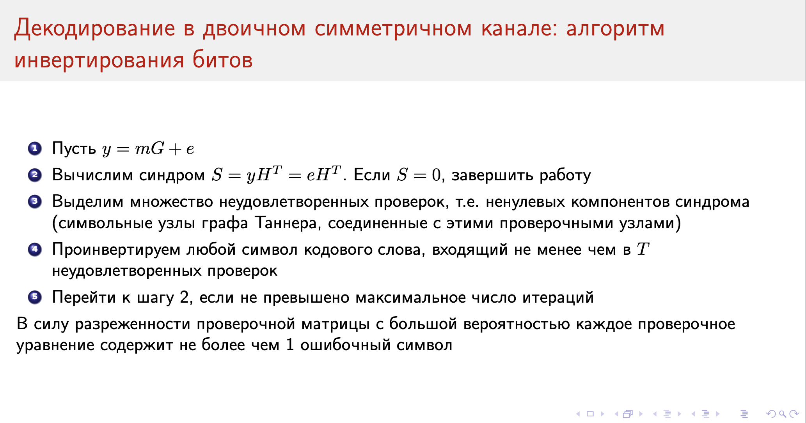

# Декодирование низкоплотностных кодов

*Рассмотрим два алгоритма декодирования. Один, скорее, игрушечный, а другой --- зубодробительный*

## Алгоритм инветрирования битов

Возьмём граф Таннера, подставим в символьные узлы пришедшее сообщение, и будем проверять один за одним. Если для какого-то символьного узла **не выполнено** проверок больше, чем некоторое число $t_j$ (например, половину проверок), инвертнём его, и попробуем пройтись снова. Из-за того, что граф разрежен, скорее всего, каждая ошибка несёт влияние всего на один проверочный узел (верим). И типа поэтому он сходится (что, вообще говоря, не факт).

## Алгоритм распространения доверия

Тут проще посмотреть на простой случай с двоичным стирающим каналом, и потом сразу перейти к реализации для абстрактного канала (т. к. выкладки --- это какой-то кошмар).

