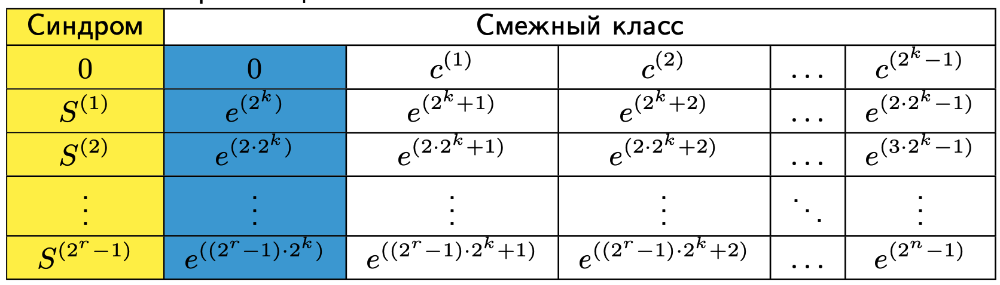

# Декодирование линейных кодов. Таблица стандартной расстановки. Код Хемминга. Стирания

## Код хэмминга

Выберем в качестве столбцов проверочной матрицы $H$ все ненулевые двоичные вектораа длины $r$. Тогда мы получим, что

* Длина кода $n = 2^r - 1$
* Размерность $k = n - r = 2^r - r - 1$
* Минимальное расстояние $d = 3$. Это не было доказано, но утверждается что это следует из построения и из того, что все вектора, которые мы берем они различны, а следовательно мы будем иметь 2 линейно независимых столбца и 3 линейно зависимых. (Почему - непонятно)
* Такой код является совершенным, так как лежит на границе Хемминга: $\sum_{i=0}^1 C_n^i = n + 1 = 2^{n-k}$. Совершенных кодов кроме кода Хемминга и кода Галея не бывает.
* Кодирование: все информациолнные символы расположены во всех позициях, кроме $2^j$
* Декодирование: синдром задает местоположение ошибочной позиции.
* Впервые были использованы в 1957г. при отправке искуственного спутника земли.
* Симплексный код - ($2^m - 1, m, 2^m - 1$) код, с порождающей матрицей $H$ вышеуказанного вида (код, дуальный коду Хемминга). Все его кодовые слова равноудалены друг от друга.

## Декодирование линейных кодов и таблица стандартной расстановки

Рассмотрим двоичный симметричный канал с переходной вероятностью $p < 0.5$.

Принятый вектор мы можем представить следующим образом: $y = xG + e$, где $G$ - порождающая матрица, а $e$ - вектор ошибки.

Декодирование можно реализовать следующим образом: возьмем и переберем все кодовые слова. Сложность такого алгоритма получиться $O(2^kn)$. Это очень много, поэтому сделаем следующее:

Рассмотрим **синдром** принятого вектора:

$$S = yH^T = xGH^T + eH^T = eH^T$$

Окажется, что наш вектор синдромов зависит только от вектора ошибки. Векра $e$ длины n отображаются в вектора синдромов меньшей длины. Это неоднозначная зависимость.

Какой же вектор $e$ следует сопоставить синдрому $S$?

Сделаем следующее: рассмотрим все возможные вектора $e$ и выпишем соотвествующие синдромы.

Отсортируем по весу вектора $e$ и выпишем соотвествующие синдромы.

После этого отсортируем по весу все вектора $e$, соотвествующие каждому возможному значению синдрома (это называется **стандартной расстановкой**). И запишем это в таблицу:

Это и называется таблицей стандартной расстановки.

Строки здесь пронумерованы различным векторами синдрома. В каждой строке выписаны все вектора, которые соотвествуют синдрому. Вектора наименьшего веса загоним в голубой столбец.

Вектора наименьшего веса, соотвествующий какому-то синдрому, называется **лидером смежного класса**

Кодовое слово находиться в нулевой сроке столбца, в котором был записан принятый вектор в такой таблице, а сам размер таблицы будет составлять $2^r$

---

Стоит отметить, что при декодировании по такой таблице нам достаточно только первых двух столбцов. Почему так можно делать? Мы выяснили, что в двоичном симметричном канале, у нас декодирование по максимуму правдоподобия эквивалентно декодированию по критерию минимальному расстоянию Хемминга. Нам нужно найти наименьший возможный вектор $e$, удовлетворяющий $S = eH^T$. Именно поэтому мы здесь и берем вектор $e$ наименьшего веса. Фактически позволяет декодировать за одну операцию, но жрет очень много памяти ($O(2^r)$)

---

## Стирания

Иногда нам известно, что отдельные символы кодового слова продектированы ненадежно (или вообще пропали). Заменим такием символы на $\epsilon$ перед декодированием.

Также стираниями могут считаться потери паакетов в компьютерных сетях.

В чем проблема?

При большом числе получателей каждый пакет потеряется почти у всех, если это большое число получателей просит одновременно данные у нас. Например у первого потеряется первый пакет, у второго - второй пакет и так далее. В результате серверу придется отправлять заново весь массив данных. Это неэффективно.

Для борьбы с такого рода являениями используют коды исправляющие стирания. Можно пронумеровать все пакеты, получатель поймет что ему не дошло и пытаться исправить стирания. (если перед отправкой данные закодированы). Для этой цели используются фонтанные коды.

Мы рассматриваем задачу стирания, когда **стиранием** называются какие-то ненадежные символы.

Декодеру приэтом может понадобиться исправлять не только стертые символы, но и ошибочные символы. **Декодер знает, какие символы были стертыми, но не знает, какие символы были ошибочными**

Утверждается, что код с минимальным расстоянием $d$ способен исправить любую комбинацию из $t$ ошибок и $v$ стираний, если $d \geq 2t + v + 1$

В чем логика? Если мы стерли v символов, то фактически мы уменьшили минимальное расстояние на $v$. То есть фактически код наш стал с минимальным расстоянием $d - v$, а он может исправить t ошибок, только если $d - v \geq 2t - 1$.

**Как сделать декодер исправляющий ошибки и стирания?**

Если у нас уже есть декодер исправляющий ошибки, с помощью него мы можем сделать следующую вещь (в поле $GF(2)$):

* Положить все стертые позиции равными 0, исправить ошибки в полученном векторе
* Положить все стертые позиции равные 1, исправить ошибки в полученном векторе
* Выбрать результат декодирования, ближайший к принятому вектору

Здесь приходиться 2 раза проводить декодирования ошибок, что не самый эффективный метод.

Иногда можно построить алгоритм декодирования, способный одновременно исправлять как ошибки, так и стирания.
